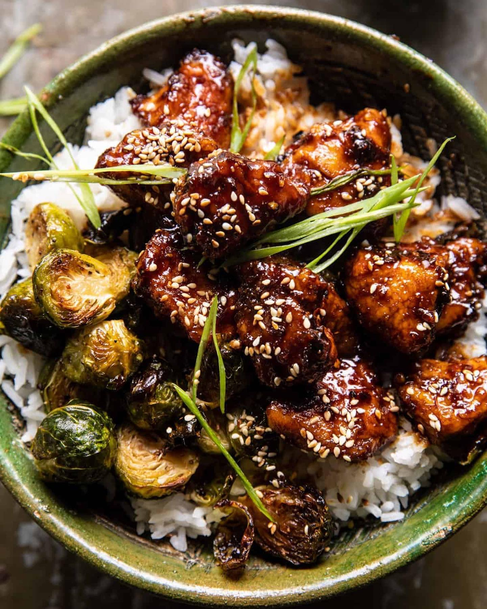

---
image: ../pics/chicken-ginger-brussels.jpg
---
# Курица с имбирем и брюссельской капустой

#### Ингредиенты
на 6 порций

* куриные грудки без кости 700 г
* 1 яйцо
* мука 30 г
* соль, перец
* брюссельская капуста 340 г
* оливковое масло
* семена кунжута

**для соуса:**
* соевый соус 150 г
* гранатовый или яблочный или апельсиновый сок 70 г
* мёд 85 г
* бальзамический уксус 2 ст л
* яблочный уксус 1 ст л
* арахисовая паста 1 ст л
* чеснок 2 зубчика
* свежий имбирь 2 см
* хлопья чили 1 ч л

#### Приготовление

Курицу нарезать небольшими кусочками, в миске смешать курицу, яйцо и щепотку перца, перемешать. Добавить муку в другую миску, обвалять курицу партиями в муке. Положить курицу на одну сторону подготовленного противня. Сбрызнуть 2 столовыми ложками масла.

Брюссельскую капусту разрезать пополам, перемешать с 2 столовыми ложками масла, солью и перцем. Выложить на вторую сторону противня срезом вниз. Запекать 12 минут при 200С конвекция. 

Тем временем смешать все ингредиенты соуса в сотейнике, довести до кипения на среднем огне. Варить 5-8 минут, пока соус не загустеет и не выпарится примерно на треть. Снять с огня.

Перемешать капусту, перевернуть курицу и вернуть в духовку еще на 3–5 минут до готовности курицы. Уменьшить температуру духовки до 180С.

Вылить половину соуса на курицу, перемешать. Вернуть все в духовку на 3 минуты, внимательно следить, чтобы соус не подгорел.

Подавать курицу с рисом, посыпав кунжутом. Подавать брюссельскую капусту отдельно.

*ig: halfbakedharvest*