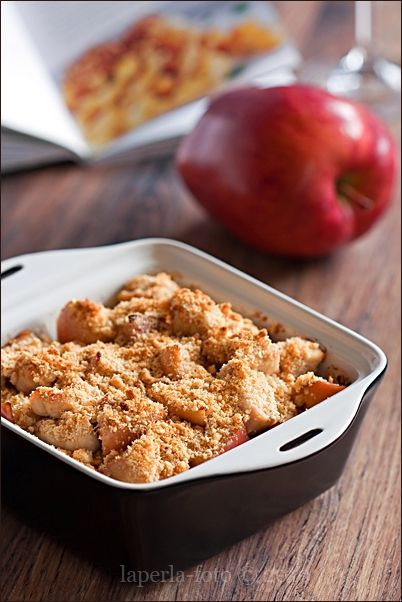

# Крамбл с яблоками, курицей и мёдом

#### Ингредиенты

6 порций

* 6 куриных филе
* 2 яблока
* оливковое масло 2 ст л
* мёд 3 ст л
* винный уксус 1 ст л
* соевый соус 2 ст л
* тертый имбирь 2 ст л
* душистый перец 0,5 ст л
* белое вино 100 мл
* сливочное масло 20 г
* соль, молотый черный перец

**для посыпки:**

* китайская кунжутная нуга 50 г
* панировочные сухари 50 г

#### Приготовление

Филе нарезать ломтиками. Яблоки очистить, удалить сердцевину, нарезать кубиками.

Филе и яблоки обжаривать на оливковом масле 5 минут.

Смешать мёд с уксусом, соевым соусом, перцем, белым вином, солью и перцем.

Добавить соус к филе и готовить еще 5 минут на слабом огне.

Для посыпки китайскую нугу измельчить в блендере, в крошку или сделать крамбл по другому рецепту.

Смешать с панировочными сухарями.

В форму, смазанную сливочным маслом, выложить филе с яблоками и соусом, посыпать крошкой.

Запекать в духовке при 180 градусах.

*laperla-foto.livejournal.com*
