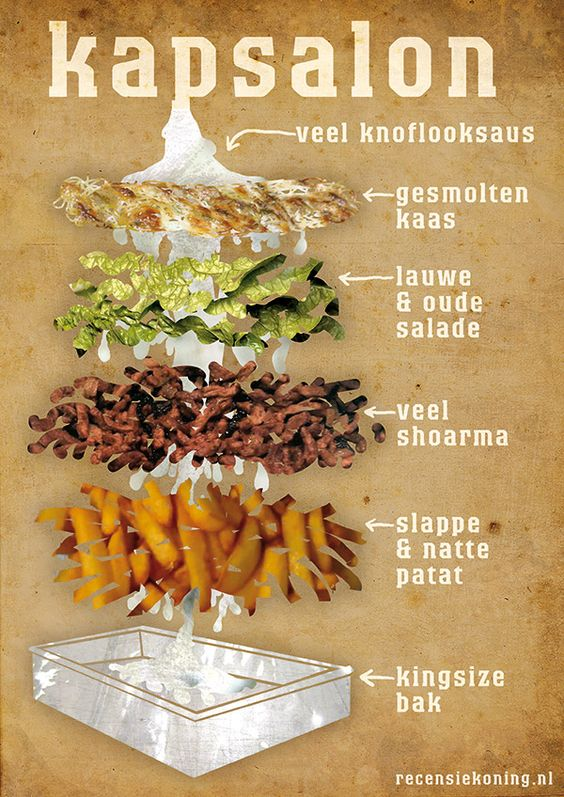

---
image: ../pics/kapsalon.jpg
---
# Голландский капсалон \| Kapsalon

Блюдо придумал голландский парикмахер, вдохновившись тем, как готовят шаверму в киоске по соседству с салоном. В капсалоне он соединил все свои любимые продукты — картофель, грибы, курицу и овощи. Сейчас это блюдо популярно в Голландии и Германии в качестве уличной еды, его подают в одноразовой алюминиевой упаковке.

#### Ингредиенты:
2 порции

* Куриное филе 300 г
* Шампиньоны 150 г
* Сливки 22 % 100 мл
* Картофель стоун 400 г
* Сыр гауда 100 г
* Оливковое масло 5 мл
* Соль и перец

#### Приготовление:

Варить картофель около 10 минут, остудить и нарезать соломкой, обжарить на сковороде на небольшом количестве оливкового масла.

Куриное филе отбить, нарезать ломтиками. Грибы нарезать соломкой. Обжарить куриное филе. Отдельно обжарить грибы. Смешать грибы, лук и курицу, добавить сливки, соль и перец по вкусу. Довести массу до кипения, загустить соус на слабом огне.

В форму для запекания выложить картофель, залить сливками с курицей и грибами. Посыпать сверху тёртым сыром гауда. Поставить форму в нагретую до 180 градусов духовку и запекать 20 минут. 

Подавать с овощным салатом.

*the-village.ru*
