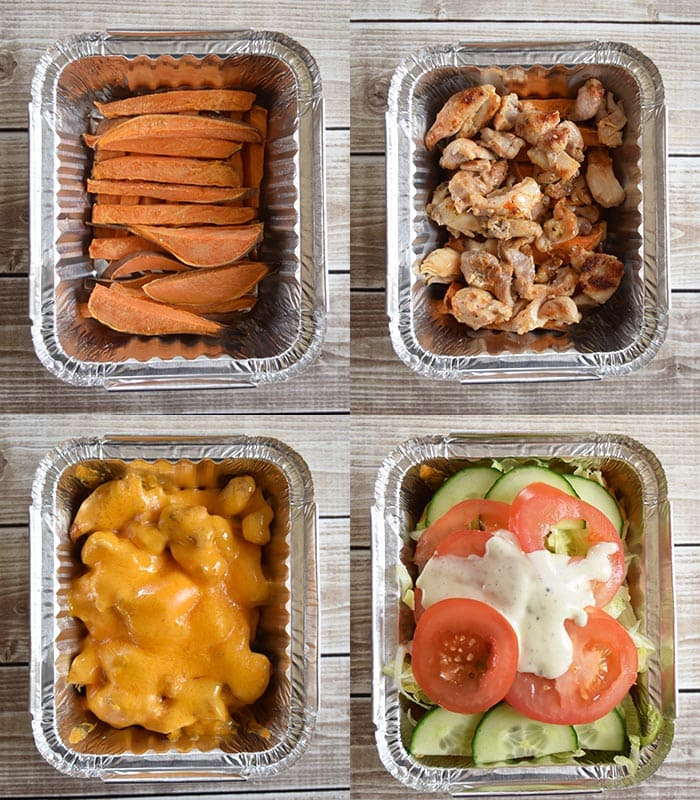

# Курица с грибами и картошкой

#### Ингредиенты
6 порций

* куриное филе 1 кг
* шампиньоны 500 г
* сливки 22 % 300 мл
* картофель 1 кг
* сыр гауда 100 г
* оливковое масло
* зира молотая, чили перец молотый, кайенский перец молотый, орегано
* соль и перец

#### Приготовление

Варить картофель около 10 минут, остудить и нарезать соломкой как для фри, сбрызнуть оливковым маслом, посыпать солью, запекать 20-25 минут.

Куриное филе нарезать ломтиками, замариновать в смеси специй. Грибы нарезать соломкой, добавить соль и перец. Обжарить куриное филе, отдельно обжарить грибы. Смешать грибы и курицу, добавить сливки, соль и перец по вкусу. Довести массу до кипения, загустить соус на слабом огне.

В форму для запекания выложить картофель, залить сливками с курицей и грибами. Посыпать сверху тёртым сыром гауда. Поставить форму в нагретую до 180 градусов духовку и запекать 5 минут. 

Подавать с овощным салатом.

*the-village.ru*
