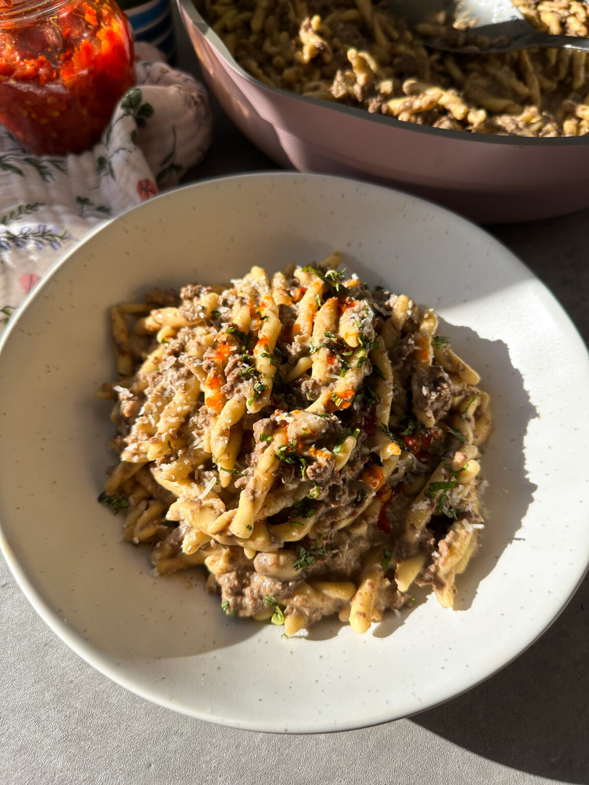

---
image: ../pics/meat-pasta.jpg
---
# Макароны с мясом

#### Ингредиенты
на 4 порции

* оливковое масло 1 ч л
* яичная лапша или короткая паста 400 г
* говяжий фарш 400 г
* 3 зубчика чеснока
* говяжий бульон 500 мл
* вустерский соус 2 ст л
* сметана 90 г
* сливки 40 г
* копченая паприка 0.5 ч л
* свежая петрушка
* соль, перец по вкусу

#### Приготовление

В большой сковороде разогреть оливковое масло на среднем огне, обжарить чеснок, добавить фарш и обжарить 3-5 мин. Добавить пасту, говяжий бульон, вустерский соус и специи, накрыть крышкой и дать покипеть до полного впитывания жидкости. Снять крышку, добавить сметану, сливки, перемешать, прогреть без крышки пару минут. Подавать украсив петрушкой.

*Ig: sammymontgoms*
