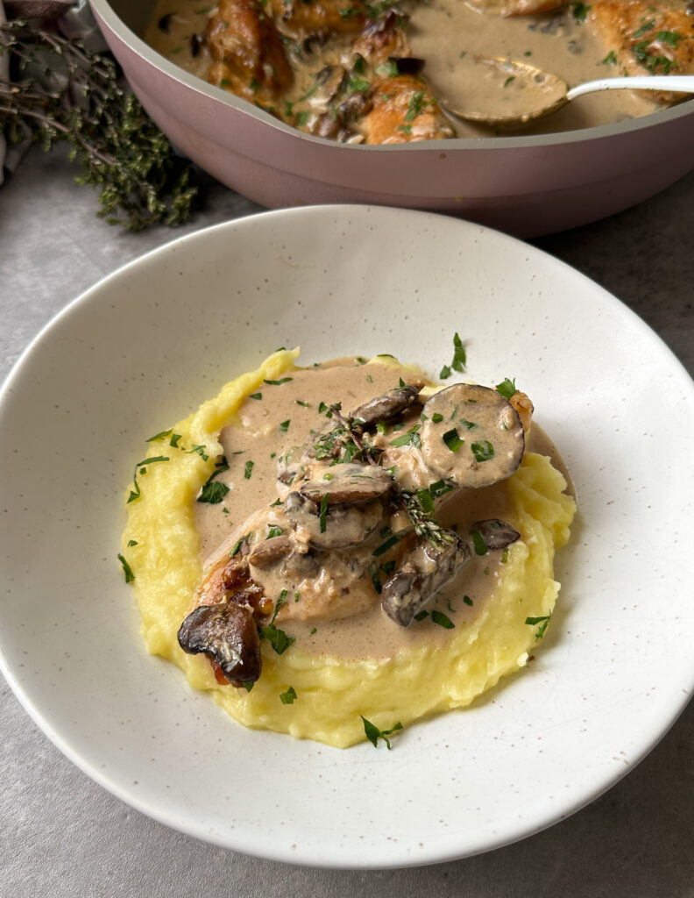

---
image: ../pics/mushroom-chicken.jpg
---
# Курица с грибами

#### Ингредиенты

* 4 куриные грудки
* Оливковое масло 1 ст л
* Сливочное масло 60 г
* Грибы 150 г
* Куриный бульон 200 мл
* Сливки 150 г
* Бальзамический уксус 1 ст л
* Белое вино 100 мл
* Пармезан 60 г
* Мука 30 г
* Копченая паприка 1/2 ч л
* Свежий тимьян
* Мускатный орех
* Соль, чесночный порошок и перец по вкусу

#### Приготовление

Разрезать грудки вдоль пополам. Нарезать грибы и отложите в сторону до использования.  
Смешать муку и приправы, добавить курицу и перемешать, чтобы равномерно покрыть мукой.  
Быстро обжарить курицу в смеси оливкового и сливочного масел, отложить на тарелку.  
В той же сковороде обжарить грибы и свежий тимьян, пока грибы не станут мягкими. Добавить бальзамический уксус и белое вино, выпарить наполовину. Добавить куриный бульон и сливки и дать покипеть в 2–3 минуты. Добавить пармезан, и тушить до загустения на медленном огне.  
Выложить обратно курицу, покрыть соусом и тушить до готовности 4-5 минут.  
Подавать украсив свежей петрушкой.

*ig: sammymontgoms*
