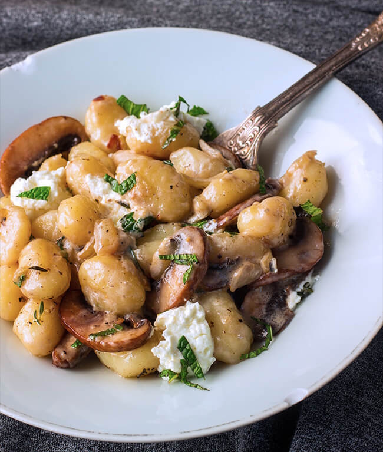

---
image: ../pics/mushroom-gnocchi.jpg
---
# Ньокки с грибами и козьим сыром

#### Ингредиенты
на 2 порции

* свежие грибы 200 г
* ньокки 250 г
* сливочное масло 0,5 ст л
* оливковое масло 0,5 ст л
* сливки 15 г
* козий сыр 50 г
* тимьян 1 ч л
* зубчик чеснока
* мята по вкусу
* соль и перец по вкусу

#### Приготовление

Отварить ньокки согласно инструкции на упаковке.  
Растопить сливочное и растительное масла в большой сковороде на средне-сильном огне, добавить тимьян и чеснок, прогреть. Обжарить грибы, добавить сливки, прогреть. Добавить ньокки, перемешать и добавить козий сыр и мяту. Посолить и поперчить.

*cookingmaniac.com*
