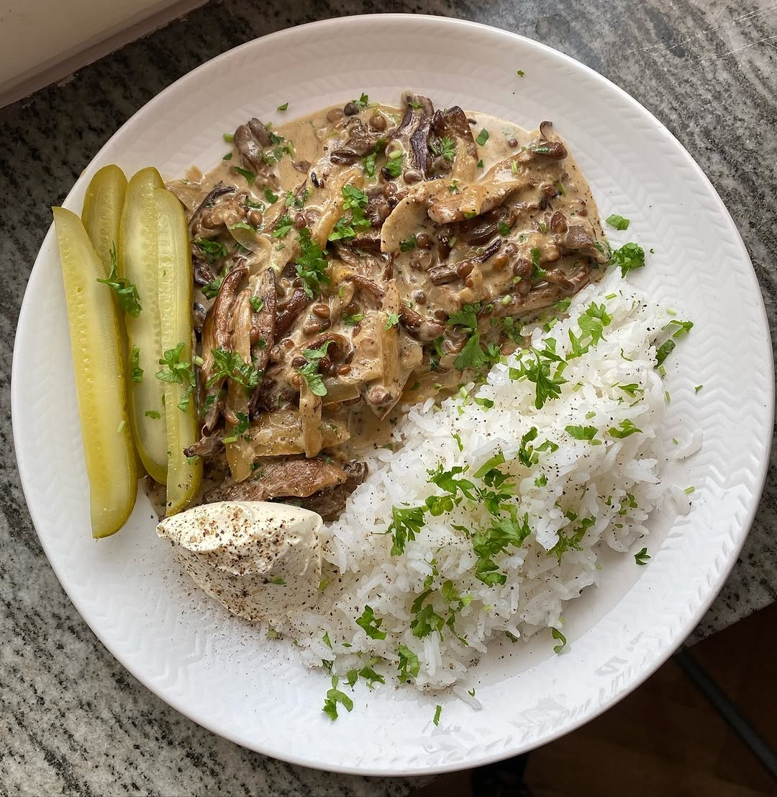

---
image: ../pics/mushroom-stroganov.jpg
---
# Грибы по строгановски

#### Ингредиенты
на 4 порции

* 400 г грибов
* сливочное масло 50 г
* зубчик чеснока
* мука 1 ч л
* сливки 300 мл
* дижонская горчица 1-2 ст л
* бульон 100 мл
* готовая чечевица 130 г
* соль и перец
* пучок петрушки
* сметана 50 г

#### Приготовление

Нарезать грибы, обжарить с небольшим количеством масла. Нарезать чеснок, добавить к грибам и обжарить до прозрачности, добавить муку, обжарить 1 минуту, добавить сливки, дижонскую горчицу и бульон, соль, перец и дать покипеть 5 мин. Добавить чечевицу и прогреть

Украсить петрушкой, подавать со сметаной и рисом.

*Ig: siribarje*
