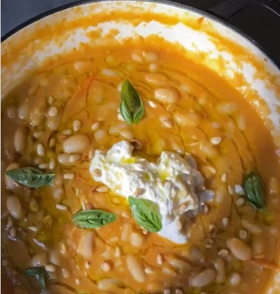

---
image: ../pics/tomato-beans.jpg
---
# Фасоль в томатном соусе

#### Ингредиенты

* 1 коробка помидоров черри
* 2 зубчика чеснока
* Фасоль каннелини 1 банка
* Базилик
* Кедровые орехи
* Буратта

#### Приготовление

Нарезать помидоры пополам. Разогреть масло в большой сковороде, обжарить чеснок, добавить помидоры. Как только они начнут развариваться, добавить немного воды, чтобы они оставались сочными. Разваренные помидоры пробить блендером. Слить воду с фасоли и добавить ее в сковороду вместе с пробитыми помидорами, прогреть пару минут. 

Снять с огня, добавить оливковое масло, базилик, кедровые орешки и сыром. Подавать горячим с тостами.

*ig:natsnourishments*
