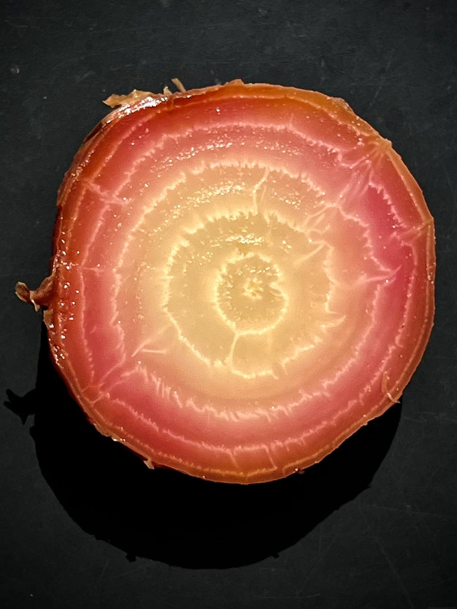

# Запекание свеклы

Завернуть каждый корень в фольгу или выложить на пергамент, закрыть сверху пергаментом, подвернув. Поставить в духовку на 230-250 С на 1,5-2 часа, вынуть, остудить. Снять кожуру, нарезать ломтиками 4 мм, посолить, брызнуть лаймом. Оставить на полчаса. 