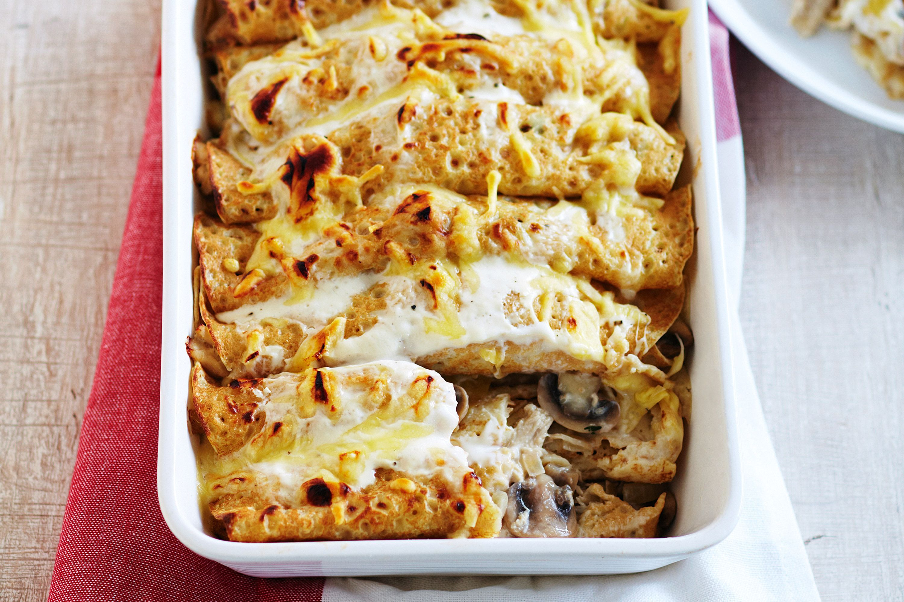

---
image: ../pics/crespelle-chicken.jpeg
---
# Креспелли с курицей и грибами

 

#### Ингредиенты:

на 2 порции

* 4 блинчика
* 300 мл [бешамель](https://mars9n9.github.io/%D0%A1%D0%BE%D1%83%D1%81%D1%8B/besciamella.html)
* 2 куриные грудки с кожей на кости
* 15 г сливочного масла
* 300 г грибов
* соль и перец по вкусу
* 1 ч л вустерского соуса
* 15 г измельченной петрушки
* сыр грюйер для украшения

#### Приготовление:

Приготовить бешамель. Разогреть духовку до 180С. 

Положить курицу на противень с решеткой и запекайть в 35-40 минут до готовности. Остудить и разделить на волокна вилкой.

Растопить сливочное масло, обжарить грибы, добавить вустерский соус, соль и перец по вкусу и свежую рубленую петрушку, остудить.

Разделить курицу и грибы на 4 порции, завернуть каждую порцию в блин. Выложить блины в смазанную малом форму, полить сверху соусом бешамель, посыпать сыром грюйер и паприкой.  Поставить в разогретую духовку на верхнюю полку и запекать 15 минут или до румяной корочки.

Украсить свежей петрушкой и подавать с салатом.
