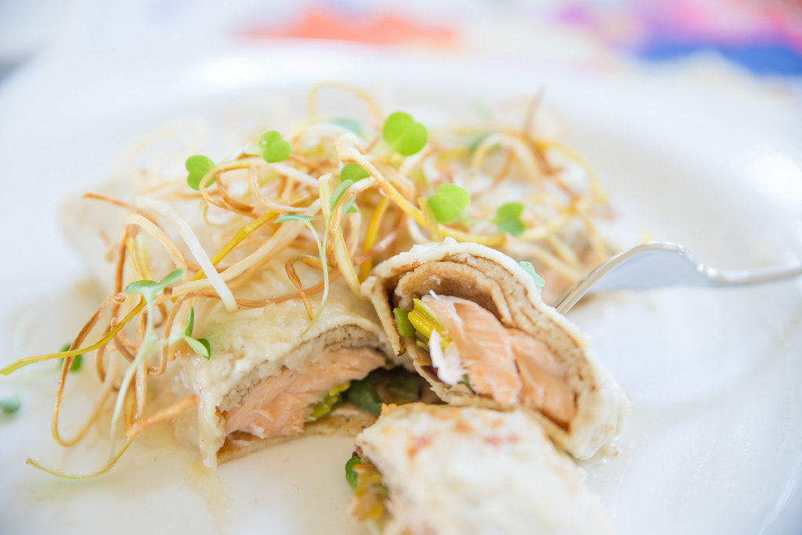

---
image: ../pics/crespelle-salmon.jpg
---
# Креспелли с лососем

 

#### Ингредиенты

на 2 порции

* 300г филе лосося
* 4 блинчика
* 300 мл [бешамель](https://mars9n9.github.io/%D0%A1%D0%BE%D1%83%D1%81%D1%8B/besciamella.html)
* 6 ст.л. тертого пармезана
* соль и перец по вкусу
* микрозелень для подачи

#### Приготовление

Приготовить бешамель. Разогреть духовку до 200С. 

Нарезать филе лосося. Посолить и поперчить. Разделить на четыре порции и завернуть каждую порцию в блинчик.

Смазать форму для выпечки оливковым маслом. Уложить в нее креспелли с лососем. Полить бешамелем и посыпать сыром. Поставить в разогретую духовку на верхнюю полку и запекать 25 минут или до румяной корочки.

Подавать украсив микрозеленью

*lg: lyukum*