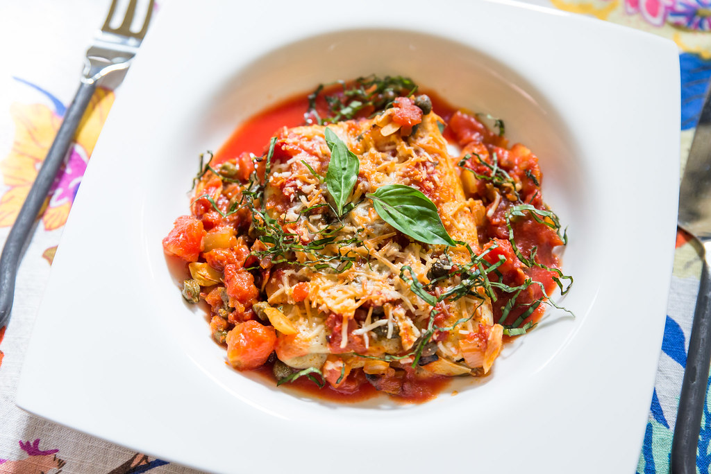

---
image: ../pics/crespelle-tomato-ham.jpg
---
# Креспелли с ветчиной и томатным соусом

 

#### Ингредиенты:

на 2 порции

* 2 блинчика
* 2 ломтика ветчины
* 2 помидора
* 1 зубок чеснока
* 6 листиков базилика
* 2 ст.л. каперсов
* 2 ст.л. оливкового масла
* 4 ст.л. тертого пармезана
* соль и черный молотый перец по вкусу

#### Приготовление:

Разогреть духовку 180С. Смазать форму для выпечки оливковым маслом. Завернуть ветчину в блинчики и уложить в форму.

Пассеровать каперсы в разогретом на среднем огне оливковом масле. Добавить нарезанные кусочками помидоры (без семян и кожицы). Тушить около 5 минут, помешивая, на среднем огне, без крышки. Добавить нарезанный тонкими ломтиками чеснок, перемешать, снять с огня.

Распределить томатный соус поверх креспелли, посыпать сыром и печь на верхней полке духовки 20 минут до румяности сыра.

Часть базилика нарезать, часть оставить целыми листиками. Посыпать горячие креспелли перед самой подачей.

*lyukum.livejournal.com*