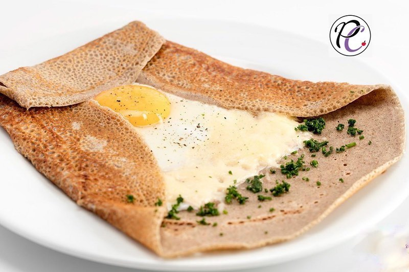
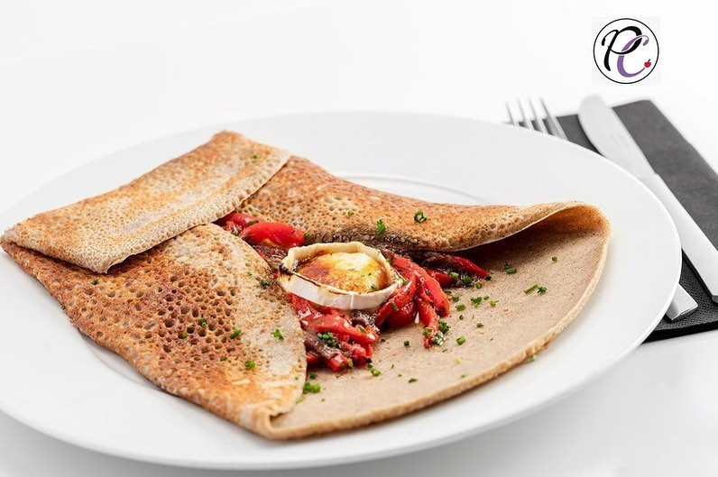
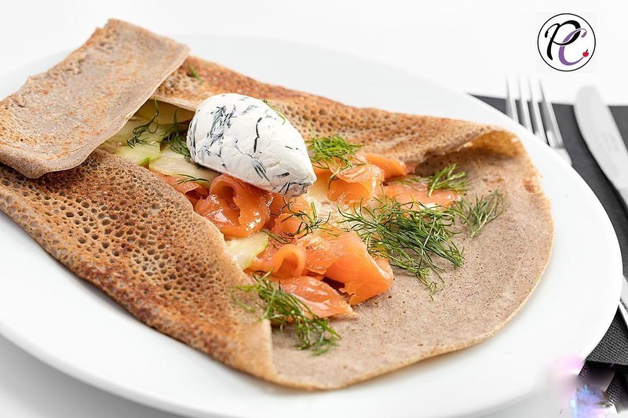

---
image: ../pics/galette.jpg
---
# Нормандские гречневые галетт

Варианты начинок:
⠀
* Яйцо+полоски ветчины+сыр Эмменталь
* Запеченные помидоры, вяленые томаты и козий сыр
* Грибная начинка с прованскими травами в сметане
* Копченый лосось+свежий огурец+сыр Филадельфия с укропом и каплей васаби (эту начинку на сковороду не класть).

#### Ингредиенты

на 1 порцию

* гречневая мука 250 г
* обычная мука или крахмал или рисовая мука 25 г
* яица 60 г
* соль 10 г
* холодная вода 500 г
* светлое пиво или сидр 125 г

#### Приготовление

Сухие ингредиенты смешать, добавить яйцо и постепенно добавлять воду, смешивая венчиком. В конце добавить пиво или сидр. Дать тесту выстояться минимум 12 часов в холодильнике.

Для выпечки хорошо разогреть сковороду или блинницу и печь, сбрызгивая масляным спреем. На большую галетт размером 32 см 150 г теста.

Поджарить с одной стороны до полуготовности, выложить начинку, закрыть с 3 или 4 сторон конвертом, довести до готовности.

*ig: maria_selyanina*
