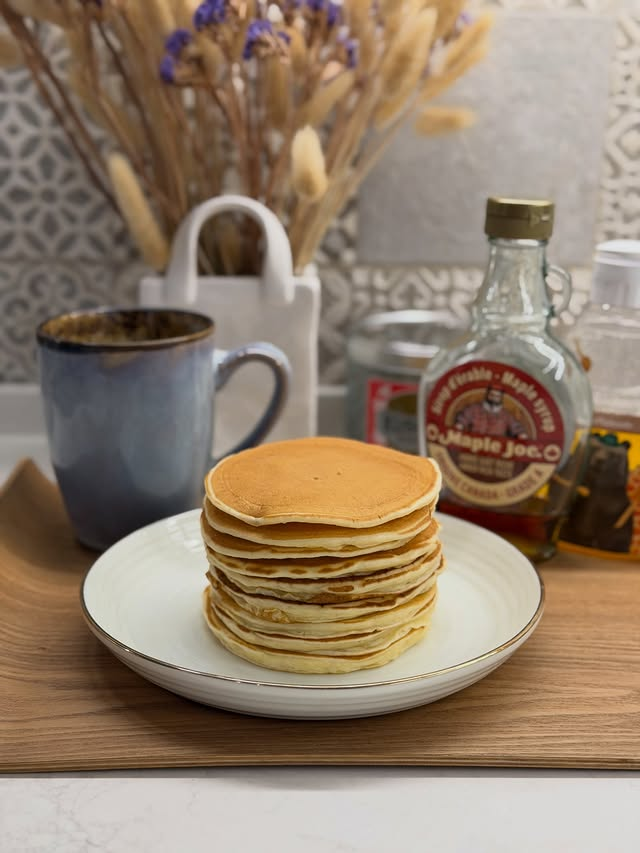

---
image: ../pics/pancake.jpg
---
# Панкейки

 

#### Ингредиенты

на 8 панкейков

* 1 яйцо
* сливочное масло 25 г
* молоко 140 г
* сахар 25 г
* щепотка соли
* мука 110 г
* разрыхлитель 1,5 ч л

#### Приготовление

Размягчить сливочное масло. Смешать яйцо, масло, молоко, сахар, соль. Добавить муку с разрыхлителем.
Пробить блендером, чтобы не было комочков.
Жарить на хорошо прогретой сковороде без масла.

*ig: foodedlife*