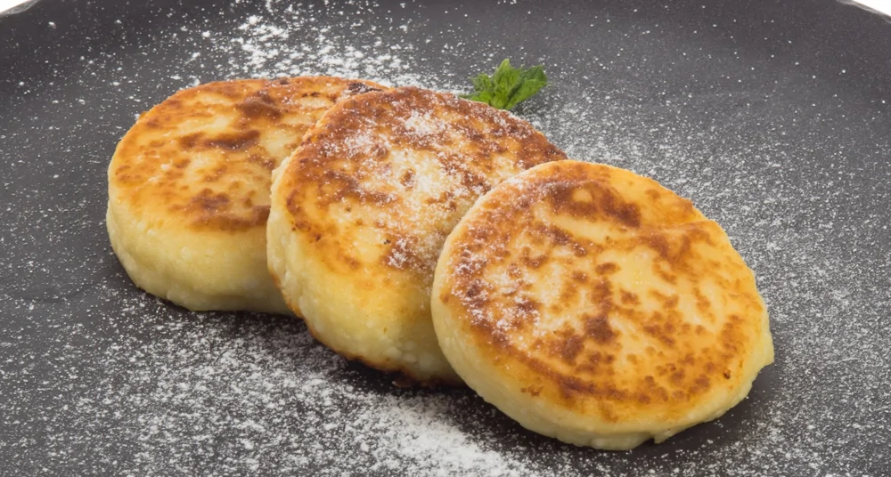

---
image: ../pics/syrniki.webp
---
# Классические сырники

 

#### Ингредиенты

* сухой творог 6–9% 500 г
* сахар 50 г
* 1 яйцо или 2 желтка
* мука 100 г + для обваливания

#### Приготовление

Смешать в миске творог с яйцом и сахаром, добавить муку (не всю), хорошенько вымесить массу. Рядом поставить плоскую тарелку с мукой, чтобы обвалять в ней сырники. 

Смочить ладони водой, чтобы творог к ним не прилипал, и скатать из массы шарик. Если творожная масса расползается в руках, то добавить еще немного муки и снова перемешать. Скатать влажными руками шарики величиной с шарик для пинг-понга и расплющить с двух сторон. Обвалять сырники в муке.

Поставить сковороду на средний огонь, разогреть немного топленого масла, выложить сырники и жарить до уверенной поджаристой корочки. Затем перевернуть и обжарить с другой стороны. В конце убавить огонь до минимального, накрыть сковороду крышкой и подержать сырники на плите еще пару минут, особенно если они достаточно толстые, чтобы быть точно уверенными, что внутри они пропеклись.

*eda.ru*