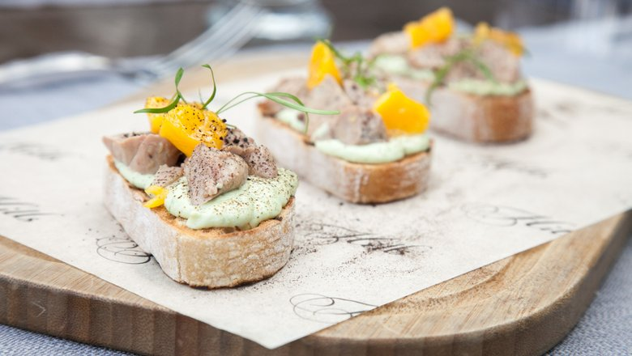

---
image: ../../pics/cod-liver.jpg
---
# Брускетта с печенью трески

#### Ингредиенты

* чабатта	3-4 кусочка
* майонез домашний	30 г
* яйца 2 шт
* зелень по вкусу
* печень трески 1 банка
* соль, перец по вкусу

#### Приготовление

Приготовить мусс: сваренные вкрутую яйца нарезать и выложить в чашу блендера, добавить зелень, домашний майонез, соль и перец по вкусу. Пробить до однородности.

Переложить мусс из яйца в кондитерский мешок, ломтики чабатты обжарить на раскаленной сковороде-гриль с двух сторон. Нанести мусс на ломтики чабатты. Сверху выложить нарезанную кусочками печень трески и низкотемпературный желток.

Посыпать черной солью, украсить зеленью и подавать

*рецепт Антона Клетарова, шефа ресторана Hills*
