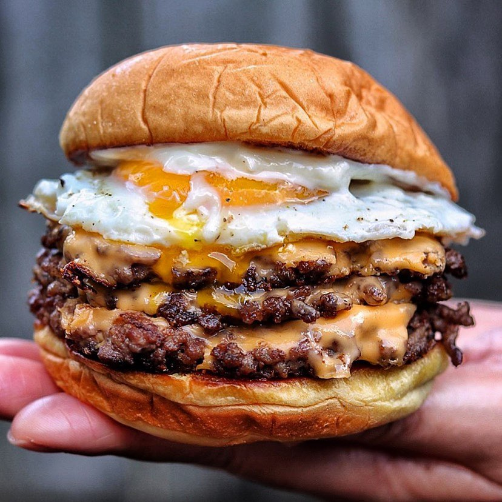

---
image: ../../pics/egg-burger.jpg
---
# Бургер из баранины с яйцом

#### Ингредиенты
на 2 бургера

* бекон 4 ломтика
* 2 булочки для бургеров
* сыр чеддер 4 ломтика
  
**для фарша:**
* бараний фарш 500 г
* молотый кумин 2 ч л
* молотый кориандр 1 ч л
* чеснок 2 зубчика

**для соуса:**
* майонез Kewpie 2 ст л
* кетчуп 2 ст л
* вяленые томаты 1 ст л
* перец чили 1 ч л
* острый соус 1 ст л
* соль, черный перец

#### Приготовление

Смешать все ингредиенты для фарша, вымесить, оставить в холодильнике на час. Вынуть и разделить фарш на четыре равных шарика. 

Для соуса нарезать мелко вяленые томаты, смешать все ингредиенты в миске и поставить в холодильник до тех пор, пока он не понадобится.

Бекон положить на холодную сковороду и поставить на средний огонь, готовить 3-4 минуты, перевернуть, прогладить, чтобы был плоским, готовить до золотистого цвета и блеска. 

Поджарить булочки на жире от бекона. Затем увеличить огонь на той же сковороде и добавить растительное масло, подождать пока слегка задымится. Выложить два шарика фарша на сковороду, хорошо раздавить и оставить карамелизоваться на 2 минуты, затем перевернуть. Положить ломтик сыра на каждую котлету и накрыть сковороду крышкой на 30–40 секунд, пока сыр не расплавится. Сложить две котлеты друг на друга, чтобы получился двойной слой. Приготовить два яйца, посыпав перцем.

Чтобы собрать, намазать соусом для бургера верхнюю и нижнюю булочки. Положить котлеты, ломтики бекона, жареное яйцо, верхнюю булочку.

*ig: notorious_foodie*