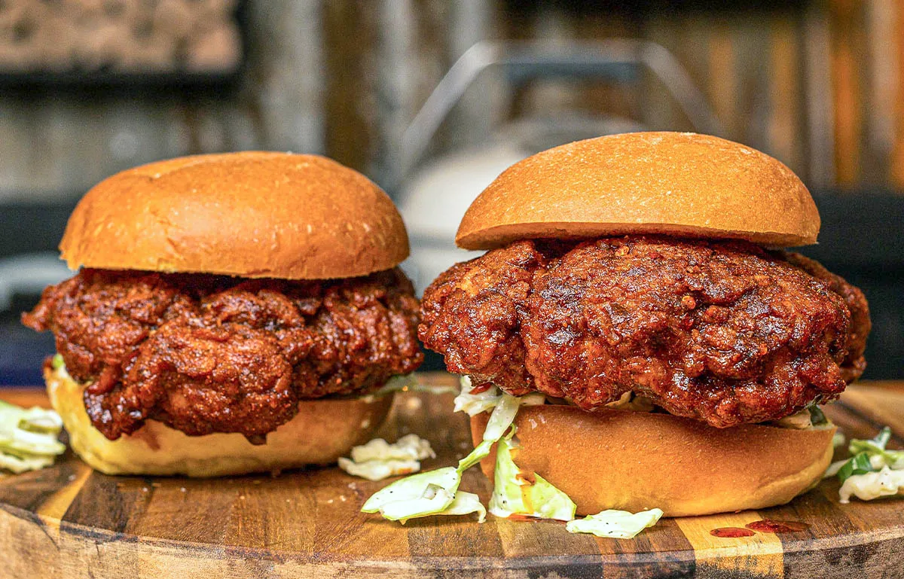

---
image: ../../pics/nashville.webp
---
# Бургер Нешвилл

#### Ингредиенты
на 2 бургера

* 2 куриных бедра без кости и кожи
* мука
* крахмал
* сливочное масло 60 г
* 2 булочки для бургеров
* маринованные огурцы

**для маринада:**
* сметана 100 мл
* рассол от маринованных огурцов 20 мл
* кайенский перец ½ ч л
* чесночный порошок ½ ч л
* орегано ½ ч л
* копченая паприка ½ ч л
* соль и черный перец по вкусу

**для соуса для курицы:**
* кайенский перец 1 ч л
* чесночный порошок 2 ст л
* коричневый сахар 1 ст л
* соль и черный перец щепотка

**для соуса для бургера:**
* майонез Kewpie 1 ст л
* острый соус 1 ст л
* горчица 1 ст л

#### Приготовление

Смешать все ингредиенты маринада, замариновать куриные бедра и оставить в холодильнике на час, а лучше на ночь.

Приготовить соус для бургера и оставить в холодильнике до использования.

В большой миске смешать муку с крахмалом 3:1, приправить чесночным порошком и черным перцем. Обвалять курицу в муке, плотно прижимать, чтобы покрыть хорошим слоем. 

Разогреть духовку до 170С, положить сливочное масло в противень, поместить в духовку и растопить. Выложить курицу в растопленное масло в форму для выпечки и запекать 45 минут, перевернуть один раз через 20 минут.

В новой миске смешать все ингредиенты соуса, затем добавить немного горячего масла для жарки и перемешать. Добавить в эту миску хрустящую жареную курицу, полить соусом.

Поджарить булочки на сливочном масле. Смешать все ингредиенты соуса для бургера, добавив каплю рассола.

Чтобы собрать, намазать соусом для бургера верхнюю и нижнюю булочки. Положить тонко нарезанные огурцы на нижнюю булочку, нарезанный соломкой салат, хрустящую курицу, ломтик сыра, накрыть верхней булочкой

*ig: notorious_foodie*