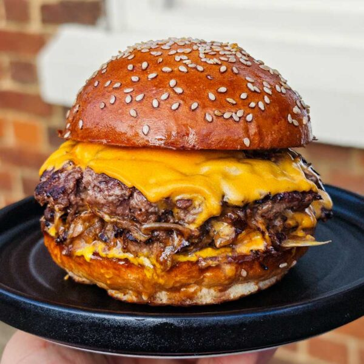

---
image: ../../pics/oklahoma.jpg
---
# Бургер Оклахома

#### Ингредиенты
на 2 бургера

* говяжий фарш (20% жирности) 500 г
* соль и черный перец по вкусу
* 4 маринованных огурца
* бекон 4 ломтика
* 2 булочки для бургеров
* сыр чеддер 4 ломтика
* растительное масло для жарки

**для соуса:**
* майонез 4 ст л
* кетчуп 2 ст л
* дижонская горчица 1 ст л
* острый соус 1 ч л
* вустерский соус 1 ч л
* копченая паприка ½ ч л
* рассол от маринованного огурца 1 ст л
* 2 маринованных огурца

#### Приготовление

Разогреть духовку до 180 °C. Выложить бекон на противень, сверху прижать другим противнем, чтобы он оставался плоским. Выпекать 15–18 минут до хрустящей корочки.

Для соуса нарезать корнишоны мелким кубиком, смешать все ингредиенты в миске и поставить в холодильник до тех пор, пока он не понадобится.

Разделить фарш на четыре равных шарика. Разогреть сковороду на сильном огне, слегка смазать сковороду маслом и положить шарик говядины. Использовать лопатку, чтобы раздавить бургер. Приправите солью и черным перцем. Готовить 2–3 минуты до карамелизации, затем перевернуть и готовить еще 1–2 минуты.

Положить ломтик сыра на каждую котлету и накрыть сковороду крышкой на 30–40 секунд, пока сыр не расплавится. Повторить для всех котлет.

Растопить немного масла в сковороде на среднем огне. Положить булочки срезом вниз и поджарить до золотисто-коричневого цвета и хрустящей корочки, около 1-2 минут.

Чтобы собрать, намазать соусом для бургера верхнюю и нижнюю булочки. Положить тонко нарезанные огурцы на нижнюю булочку, затем две сложенные друг на друга котлеты. Разломить каждый ломтик бекона пополам и положить по две половинки на бургер. Закончить верхней булочкой и сразу подавать.

*ig: food_with_george*