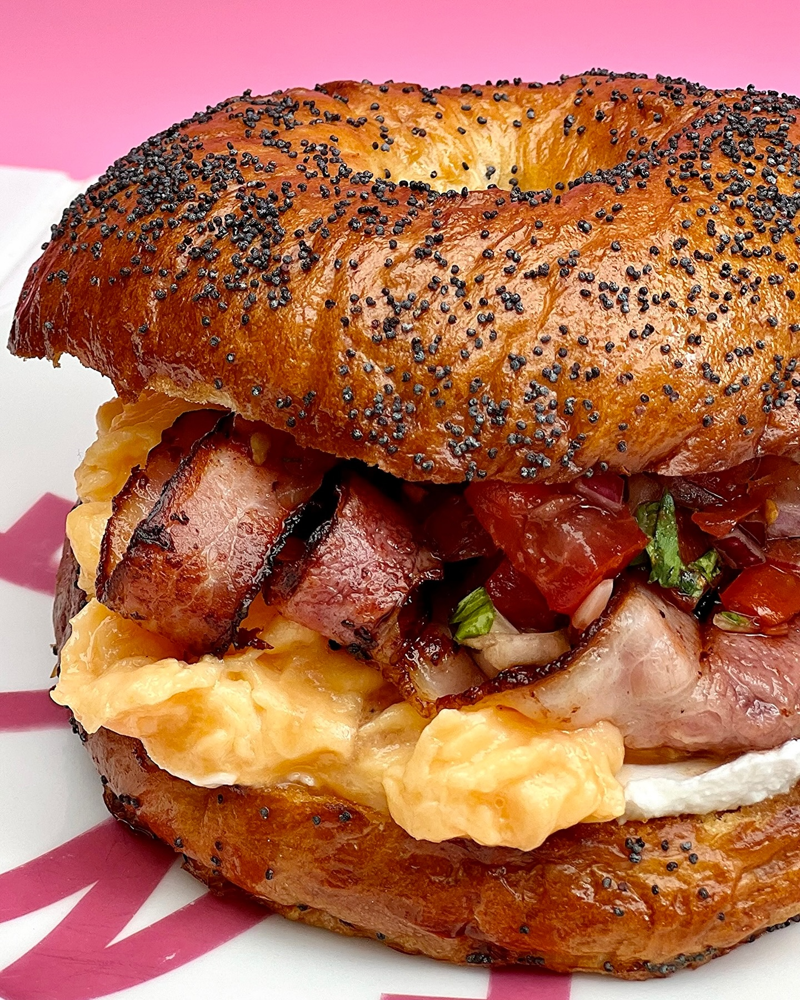

---
image: ../../pics/bagel-egg.jpg
---
# Бейгл с яйцом на завтрак

#### Ингредиенты

* бейгл
* бекон
* кримчиз
* яйца
* томатная сальса

#### Приготовление

Поджарить тонкие ломтики бекона до золотистой корочки. Приготовить сальсу. Приготовить яичницу скрембл.
Бейгл разрезать, намазать тонким слоем сливочного масла и поджарить. На нижнюю половинку намазать творожный сыр, сверху выложить скрембл, томатную сальсу, поджаренный бекон и накрыть второй половинкой

*ig: eggsellent*
