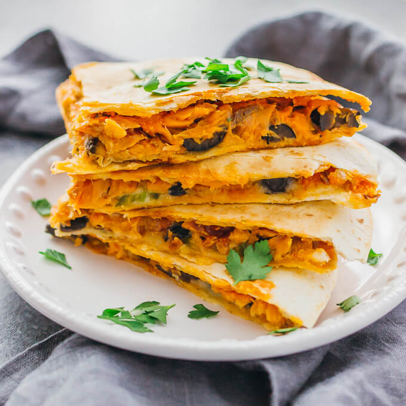

---
image: ../../pics/quesadilla-salmon.jpg
---
# Кесадилья с лососем

#### Ингредиенты
на 1 порцию

* 2 яйца
* 1 кукурузная тортилья
* лосось
* сыр по вкусу
* японские специи
* растительное масло

#### Приготовление

Разогреть растительное масло в сковороде. Яйца взбить со специями, выложить в сковороду, добавить тонко нарезанную рыбу, сверху положить лепешку, через несколько минут перевернуть ее, добавить тертый сыр и сложить пополам, подрумянить пару минут с каждой стороны.

*ig: luisamoron*
