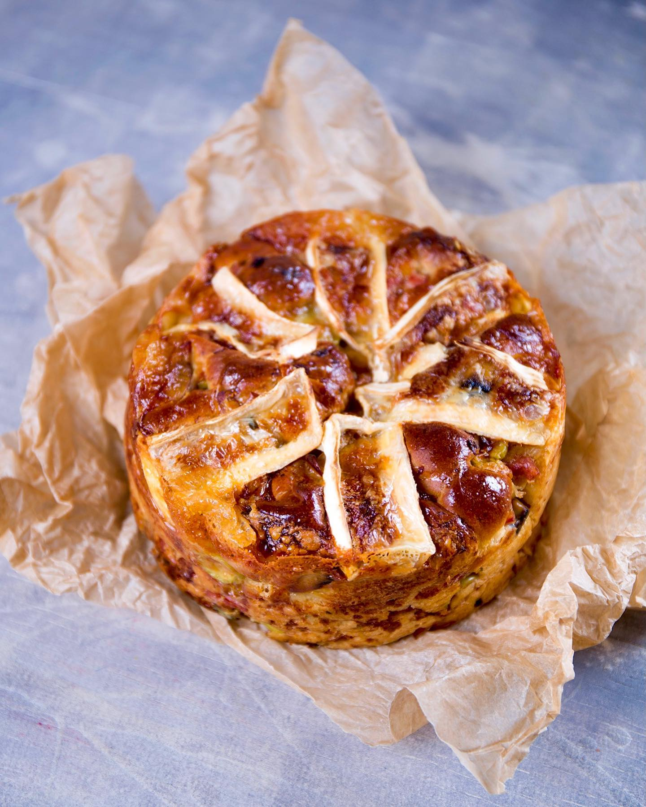

---
image: ../pics/cheese-brioche.jpg
---
# Сырная бриошь

#### Ингредиенты
на 2 формы 18 см

**для заварки:**
* рисовая мука 20 г
* вода 55 г
* цельное молоко 55 г

**для теста:**
* вся заварка
* сильная мука 310 г
* молоко 80 г
* сухое молоко 13 г
* 1 большое яйцо
* сухие дрожжи 5 г
* соль 5г
* коричневый сахар 40 г
* холодное сливочное масло 50 г

**для начинки:**
* чеснок 20 г
* тертый сыр 150 г
* оливки 40 г
* грибы 100 г
* свежий базилик 15 г
* вяленые томаты 50 г
* оливковое масло 1 ст л
* сыр бри 200 г

#### Приготовление

Приготовить заварку. Все ингредиенты сложить в сотейник и нагреть до 65С, охладить 12 часов в холодильнике.

Смешать все жидкие ингредиенты, к ним добавить все сухие. Замесить в дюже кухонного комбайна с насадкой «крюк» все, кроме масла 6 минут. Затем по чуть-чуть добавить холодное сливочное масло и замесить еще минут 5. Убрать тесто в теплое место на 2-3 часа.

Грибы обжарить, охладить. Все, кроме сыра "бри", измельчить в миску.

Тесто выложить на рабочую поверхность, сверху - холодную начинку. Замесить руками, чтобы смешать тесто с начинкой, затем скребком разделить хаотично.

Кусочки теста и начинки выложить в 2 формы 18 см в диаметре и поставить еще на 2 часа в теплое место.

Когда пирог подойдет, смазать смесью из яйца и молока, сверху уложить дольки сыра бри и запечь в духовке при 175С около 30-40 минут. Готовность проверить термометром, температура внутри должна быть 94С-96С.

*ig:niksya*
