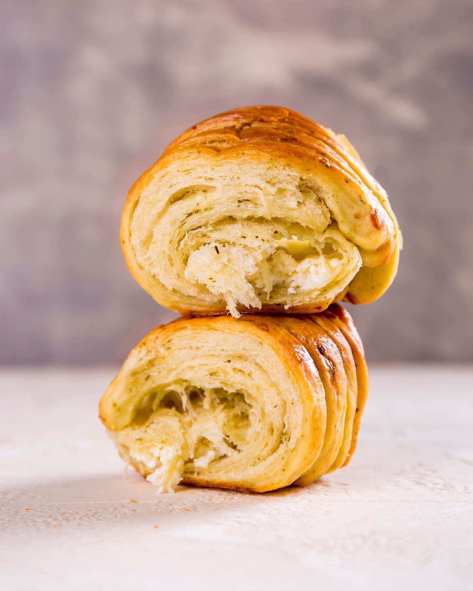
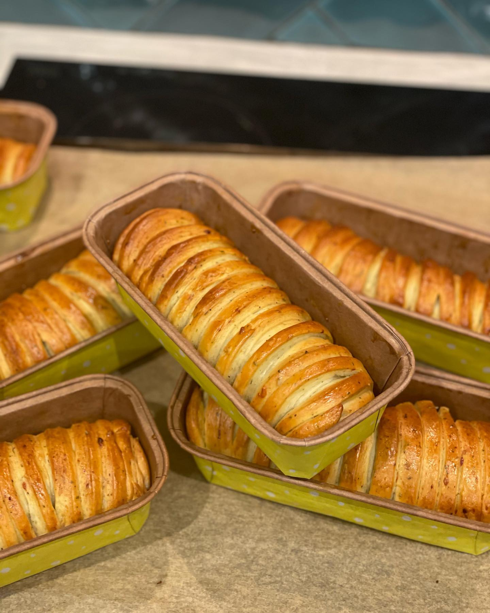

# Булочки с начинкой из трех видов сыра

#### Ингредиенты

на 8 длинных булочек

**для теста:**

* сухие дрожжи 10 г
* сахар 15 г
* теплое молоко (28С) 200 г
* вода (34С) 200 г
* растительное масло 200 г
* соль 1 ч л
* мука 750 г
* песто 50 г
* прованские травы 1 ч л

**для начинки:**
* фета 200 г
* грюйер 100 г
* крем-чиз 100 г
* _50 г орехов кедровых, грецких или пекан \(по желанию\)_

**для смазывания теста:**

* 1 яйцо
* молоко

#### Приготовление

Дрожжи растворить в теплой воде с добавлением сахара и несколькими ложками муки. Оставить на 10-15 минут.

Смешать все ингредиенты с насадкой «крюк» до объединения. Если тесто все еще липнет к рукам — добавить немного муки.

Переложить тесто в глубокую миску, смазанную растительным маслом и накрыть пленкой. Оставить расстаиваться на 1,5-2 часа. 

Затем обмять и разделить тесто на 8 равных частей. Каждую раскатать в овал, с одного края выложить начинку (просто все смешать), а все остальное пространство нарезать на тонкие ленты, толщиной около 0,5 см, доходящие по длине до самой начинки.

Начать заворачивать в рулет со стороны сыра.

Должна получиться полосатая колбаска.

Полученную колбаску выложить в бумажную прямоугольную форму для кексов или бриошей, размером 17х7 см и высотой 5 см. Дать расстояться при комнатной температуре (накрыв пленкой или полотенцем) около 1-1,5 часов.

Смазать льезоном (яйцо и молоко) и выпекать при 180С около 15-20 минут или до румяного цвета.

Можно выпекать в формах и без них. Если выпекаете в формах, то доставать, когда они немного остынут.

*ig: niksya*
