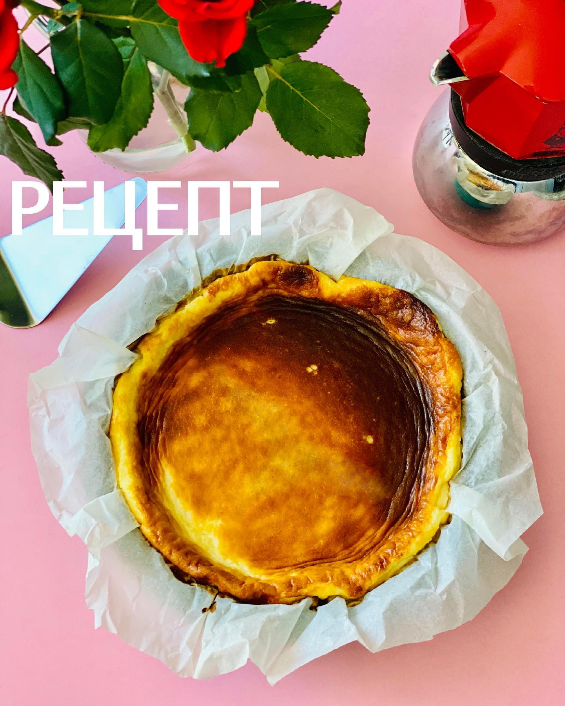

---
image: ../pics/cheesecake-san.jpg
---
# Чизкейк Сан-Себастьян

#### Ингредиенты
на форму Ø20-22см

* сливочный сыр  210 г
* камамбер или бри 85 г
* горгонзола 23 г
* сахар 20 г
* 5 желтков
* 1 яйцо
* сливки 20-30% 410 г

#### Приготовление

В блендере смешать сыры и сахар. Хорошо пробить, чтобы получить кремовую однородную смесь. Добавить желтки и яйцо. Пробить.  
Добавить сливки, снова пробить.  
Форму для запекания застелить пергаментной бумагой.  
В форму через сито вылить смесь.  
Отправить в холодильник на 2 часа.  
Выпекать при 190С минут 40-50, выключить духовку и оставить чизкейк ещё на 5 минут. Остудить и отправить в холодильник минимум на 6 часов, а лучше на ночь.  

*ig: foodedlife*
