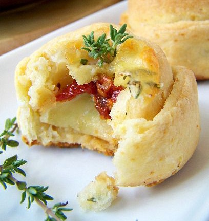

---
image: ../pics/cream-bun-mozarella.jpg
---
# Сливочные булочки с тимьяном, моцареллой и вялеными помидорами

#### Ингредиенты

на 12 булочек

* сливки 33-35% 200 г
* сливочное масло 10 г
* мука 310 г
* соль 1/2 ч л
* коричневый сахар 8 г
* разрыхлитель 10 г
* листики свежего тимьяна 1 чл + несколько веточек для декора
* тимьянно-лимонная соль 1/2 чл
* моцарелла 150 г
* вяленые томаты в масле

#### Приготовление

Сливки прогреть до комнатной температуры. Растереть в миске размягченное масло с листиками тимьяна и коричневым сахаром. Муку просеять, смешать с солью и разрыхлителем. Влить сливки, смешать. Добавить масло и вымесить. Тесто должно быть очень нежное и мягкое, и должно слегка липнуть к рукам.

Припылить разделочную поверхность, раскатать тесто толщиной примерно 5-7 мм, припыляя мукой. Вырезать круглые лепешки диаметром 10 см. Надрезать каждую с трех сторон. 

В середину выложить по кусочку моцареллы, вяленому помидору, завернуть попеременно стороны теста, сверху моцареллу посыпать тимьянно-лимонной солью, украсить веточкой свежего тимьяна.

Булочки переместить на противень, выстеленный пергаментом. Выпекать при 190С конвекция 20 минут, до румяности.

Перед подачей немного охладить.

*lg: lillaya*
