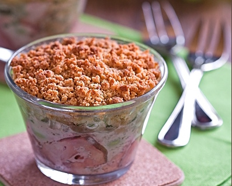

# Крамбл с печенью и виноградом

#### Ингредиенты

6 порций

* 5 порционных кусков телячьей или куриной печени
* 450 г винограда
* 2 головки лука шалот
* 5 ст. л. мадеры
* 20 г сливочного масла
* соль, молотый черный перец

**для посыпки:**

* 50 г пряников
* 50 г муки
* 40 г сливочного масла
* щепотка соли

#### Приготовление

Печень нарезать мелкими кусочками. Виноград очистить, разрезать пополам и удалить косточки. Лук-шалот мелко нарезать. Соединить печень с виноградом, луком, мадерой, солью и перцем.

Для посыпки пряник измельчить в блендере. Смешать его с остальными ингредиентами. Растереть массу кончиками пальцев в крошку.

Противень смазать сливочным маслом. Выложить на него смесь телячьей печени с виноградом и посыпать крошкой. Запекать в духовке 30 минут при 180 С.

*laperla-foto.livejournal.com*
