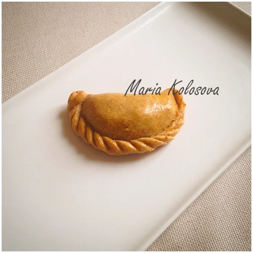

# Empanadas

Эмпанадас - блюдо, популярное в Латинской Америке и Испании. Начинки бывают совершенно разные.

### Empanadas de carne - Пирожки с мясом

#### Ингредиенты

4 порции

**для теста:**

* 500 гр кукурузной муки
* 200 гр воды
* 100 гр оливкового масла
* соль

**для начинки:**

* 500 гр говяжьего фарша
* 4 томата
* 100 гр оливок
* 400 гр лука
* 40 гр изюма
* по 1 ч.л. паприки, кумина, орегано, сахара
* соль
* оливковое масло
* 1 яичный желток

#### Приготовление

Для теста смешать все ингредиенты, завернуть в плёнку и дать отдохнуть в холодильнике.

Лук мелко нарезать. Томаты нарезать кубиком \(или лучше сделать конкассе\). Оливки мелко нарезать. Изюм замочить в тёплой воде.

На масле обжарить лук, добавить фарш, обжарить, добавить остальные ингредиенты, потушить пару минут.

Из теста раскатать диски диаметром 10 см. Края диска смазать водой, положить начинку, закрыть "эмпанадас". Смазать яичным желтком. Дальше можно запечь в духовке \(220 градусов\) или обжарить во фритюре.

П.С. Для теста нужна именно кукурузная мука, а не полента. У нас ее достать не так легко, поэтому я делала тесто из цельнозерновой муки.

_maria-cuisine.livejournal.com_

### Эмпанадас с яйцами, ветчиной, оливками и чеддером

#### Ингредиенты

4 порции

**для начинки:**

* Оливки    40 г
* Ветчина    95 г
* Желток яичный    1 штука
* Сыр чеддер    30 г
* Яйцо куриное    2 штуки

#### Приготовление

1. Положите яйца в кастрюлю, залейте водой, накройте крышкой и доведите до кипения. Варите 10 минут, слейте и охладите 5 минут в холодной воде. Очистите и мелко порежьте.
2. Разогрейте духовку до 220 градусов. Смажьте маслом 2 противня. Смешайте яйца, нарезанные оливки, нарезанную ветчину и тертый чеддер.
3. Из теста вырежьте 30 кружков. Выложите по 1 столовой ложке начинки на каждый круг, сверните тесто пополам и хорошо защипните края.
4. Выложите пирожки на противень на расстоянии 2 см друг от друга, смажьте слегка взбитым желтком и пеките на средней полке 15 минут до золотистого цвета. Если эмпанадас начали быстро коричневеть, через 10 минут накройте их фольгой. Подавайте горячими.

_eda.ru_

### Эмпанадас с грибами и горгонзоллой

* горгонзолла
* грибы
* тимьян
* яичный желток
