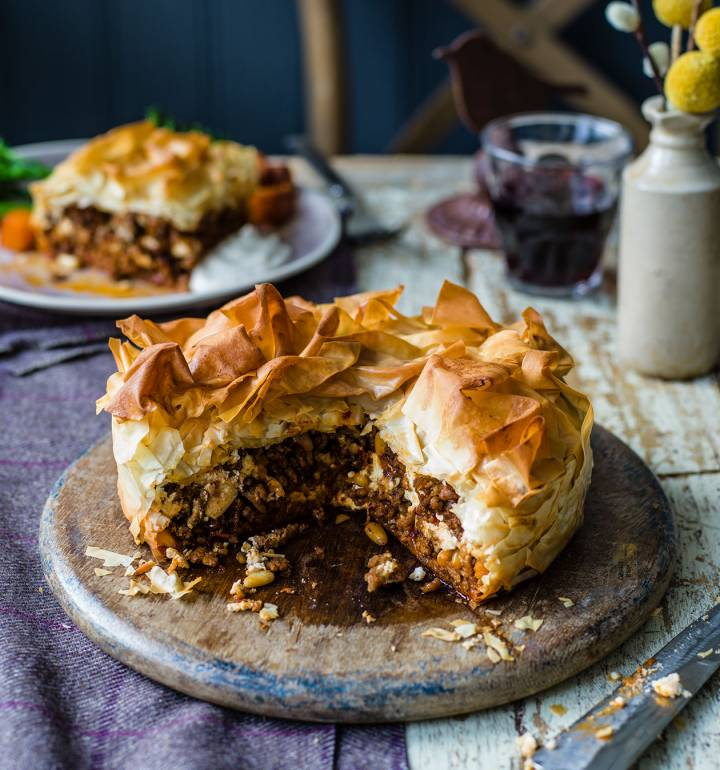

---
image: ../pics/filo-meat-pie.jpg
---
# Пирог из теста фило с бараниной и фетой

#### Ингредиенты

* фарш баранина 1 кг
* оливковое масло
* 1 морковь
* чеснок 4 зубчика
* специи бахарат 1 ст л
* семена тмина 1 ст л
* томатная паста 2 ст л
* консервированный лимон 3 шт
* кедровые орехи
* мясной бульон 250 мл
* розмарин
* фета 150 г + еще немного
* тесто фило
* сливочное масло для смазывания

#### Приготовление

Морковь нарезать кубиками, чеснок измельчить, лимоны нарезать поперек. Обжарить 1 кг бараньего фарша в разогретой сковороде с оливковым маслом. Приправить перцем и морской солью и дать всей воде испариться, а мясу карамелизироваться. Добавить морковь и обжарить 2 минуты, затем добавить чеснок, специи бахарат, семена тмина и готовить 1 минуту, добавить 2 ст л томатной пасты, перемешать, затем добавить лимоны и поджаренные кедровые орехи, перемешать. Добавить бульон и розмарин, варить на среднем огне до загустения - 25 минут, снять с огня и охладить в холодильнике 

Фету нарезать кубиками, добавить в охлажденный фарш, хорошо перемешать. Выстелить разъемную форму 2 листами теста фило, оставив излишки свисать по краям. Смазать тесто растопленным маслом, затем добавить фарш, сформировать ровный слой. Раскрошить сверху горсть феты, накрыть краями теста. Скомкать еще 2 листа фило и положить сверху, сбрызнуть маслом.

Выпекать при 180 °C на 25-30 минут или до золотистого и хрустящего состояния, затем остудить 15 минут перед подачей.

*tiktok:notorious foodie*
