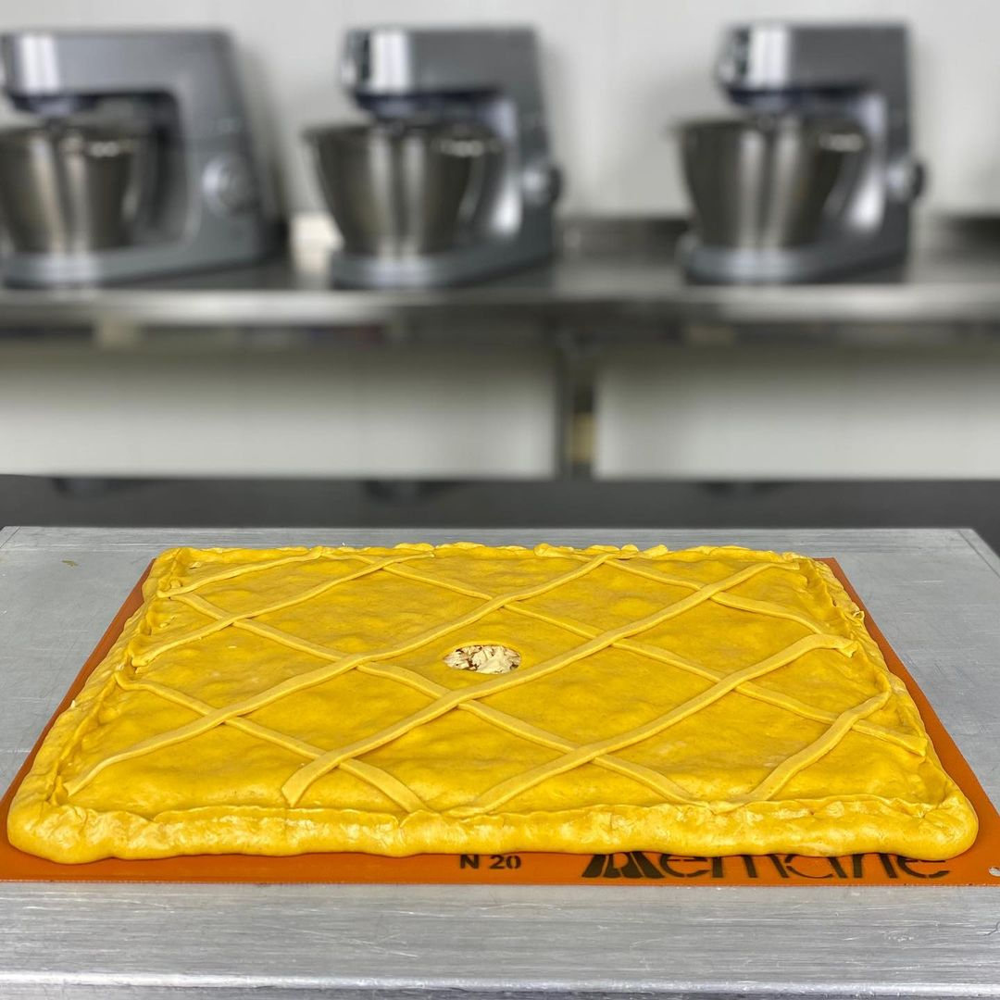

# Галисийский пирог \| Empanada gallega

#### Ингредиенты

на пирог 30х40

**для начинки:**

* 3-4 крупных луковицы
* 3-4 зубчика чеснока
* 2 больших красных перца
* 1 большой зеленый перец
* 4 средних помидора, очищенных от кожицы и семян
* 1 перчик чили без семян
* Соль, черный перец, сладкая копченая паприка на вкус
* 150 г оливкового масла
* 200 г тунца в собственном соку или в оливковом масле

**для теста:**

* 500 г обычной или хлебопекарной муки
* 100 г холодной воды
* 100 г холодного сухого белого вина
* 100 г холодного оливкового масла от зажарки
* 10 г соли
* 10 г молотой копченой паприки
* 10 г свежих дрожжей

#### Приготовление

Приготовить начинку. Все овощи нарезать на мелкие кубики \(0,5 см\). Обжарить в масле лук и чеснок до прозрачности. Добавить перцы, потушить, добавить помидоры, соль, перец, паприку. Уменьшить огонь и тушить на маленьком огне. Остудить, дать стечь маслу. Масло сохранить, использовать для теста. Добавить в начинку мясо тунца кусочками, перемешать.

Замесить тесто, скруглить, дать отдохнуть при комнатной температуре 1 час. Убрать газ, скруглить снова, охладить для раскатывания. Разделить тесто на 2 равные части, раскатать прямоугольники толщиной 2-3 мм. Охладить перед формовкой пирога. Сформировать пирог, сделать отверстие 3-4 см в центре, смазать яйцом или смазкой для выпечки. Дать расстояться 30 мин, выпекать при 180С 25-30 минут.

*@maria_selyanina*
