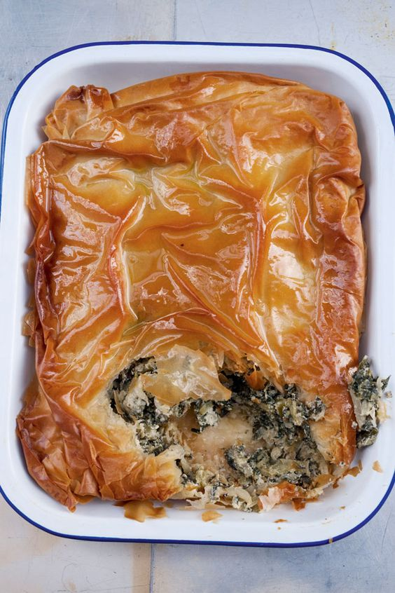

---
image: ../pics/d354322d452668abe7749d008c8d24f0.jpg
---
# Иерусалимский пирог с травами

#### Ингредиенты

* 2 столовые ложки оливкового масла плюс еще для смазывания теста
* 1 большая луковица, нарезанная кубиками 
* 500 г мангольда, стебли и листья тонко нашинковать, но держать отдельно
* 150 г сельдерея, тонко нарезанного 50 г зеленого лука, нарезанного
* 50 г руккола
* 30 г мелколистной петрушки, нарезанной
* 30 г мяты, нарезанной 20 г укропа, нарезанной
* 120 г сыра анари или рикотта, раскрошенного
* 100 г выдержанного Чеддера
* 60 г тертой феты, раскрошенной
* тертая цедра 1 лимона
* 2 средних яйца
* ½ чайной ложки соли
* ½ чайной ложки чёрного перца грубого помола
* ½ чайной ложки сахарной пудры
* 250 г теста фило

#### Приготовление

Разогреть духовку до 200°C/180°C. Налить 2 столовые ложки оливкового масла в большую глубокую сковороду. Добавить лук и обжаривать 8 минут на среднем огне, не подрумянивая. Добавить стебли мангольда и сельдерей и продолжать готовить еще 4 минуты, время от времени помешивая. Добавить листья мангольда, увеличить огонь до среднего и готовьте, помешивая, 4 минуты. Добавить зеленый лук, рукколу и зелень и готовить еще 2 минуты. Снять с огня и переложите на дуршлаг, чтобы остыть.

Как только смесь остынет, выжать как можно больше воды и переложить в миску. Добавить три сыра, цедру лимона, яйца, соль, перец и сахар и хорошо перемешать.

Выложить лист теста фило и смазать его небольшим количеством оливкового масла. Накрыть другим листом и продолжать таким же образом, пока не получите пять слоев фило, смазанных маслом, каждый из которых покроет площадь, достаточно большую, чтобы выровнять стенки и дно формы для пирога диаметром 22 см, плюс еще немного, чтобы свесить ее с края. Выстелить форму для пирога тестом, наполнить смесью трав и сложить излишки теста по краю начинки, обрезая тесто по мере необходимости, чтобы образовалась граница шириной 2 см.

Сделать еще один набор из пяти слоев фило, смазанных маслом, и положить их на пирог. Немного смять тесто, чтобы получился волнистый, неровный верх, и обрезать края так, чтобы оно только закрывало пирог. Обильно смазать оливковым маслом и запекать в духовке 40 минут или пока фило не станет красивого золотистого цвета. Достать из духовки и подавать теплым или комнатной температуры.

*Yotam Ottolenghi*
