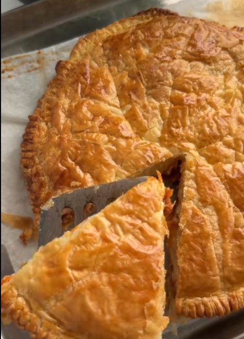

---
image: ../pics/hunters-chicken-pie.jpg
---
# Охотничий пирог с курицей

#### Ингредиенты

* Бекон 6 ломтиков
* Копченая паприка 1 ч л
* Курица готовая (вареная или жареная) 220 г
* Соус барбекю 100 г
* Пассата 130 г
* Вода 125 мл
* Слоеное тесто 2 листа
* Чеддер 80 г
* 1 яйцо

#### Приготовление

Обжарить бекон с двух сторон до коричневого цвета.

Измельчить курицу, нарезать бекон. Выложить в сковороду, добавить паприку, соус барбекю, пассату и воду. Приправить солью и перцем и довести до кипения, тушить 3 минуты, остудить.

Разогреть духовку до 190 °C (конвекция). 

Выстелить форму тестом, выложить начинку и равномерно распределить, посыпать тертым сыром. Накрыть сверху вторым листом теста, скрепить края вилкой. Смазать верхушку взбитым яйцом.

Используя тупую сторону вилки, сделать едва заметные линии от середины к внешнему краю.

Выпечь в духовке 30 минут до готовности и золотисто-коричневого цвета.

*tiktok: amysheppardfood*