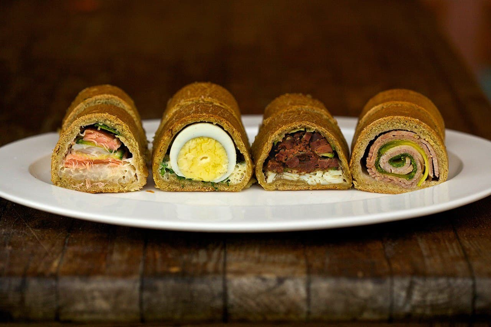

# Кулебяка

Фантастической красоты ржаные (!) кулебячки от шеф-повара ресторана «Матрёшка» Влада Пискунова:

— с копчёным лососем, муксуном и рисом;
— с яйцом цесарки и зелёным луком;
— с куриными потрошками и яйцом;
— с бужениной и молодым кабачком.

Кстати, на Русском Севере в крестьянской среде были распространены именно ржаные кулебяки. П. С. Ефименко писал, что «колюбаки» — это «пироги изъ ржанаго или крупитчатаго тѣста съ запеченною въ немъ рыбою: семгою, сигами, палтусиною и [другими]» (Матеріалы по этнографіи русскаго населенія Архангельской губерніи, 1877).

А вотъ ещё одна выдающаяся кулебяка: изъ суздальскаго ресторана «Гнѣздо пекаря (<http://www.bakernest.com/>)». Авторское описаніе: «Филе лосося, рисъ на лимонной прослойкѣ, рубленное яйцо на подушкѣ изъ укропа, томлённаго со сливочнымъ масломъ въ бѣломъ винѣ, треска, томлённая съ морковью».

_<https://t.me/ryabchiki>_
