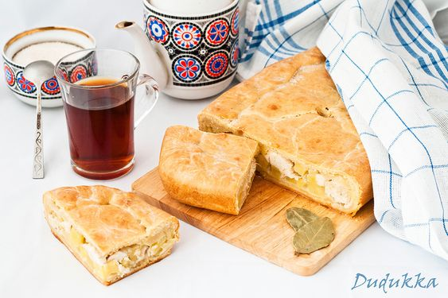

---
image: ../pics/kurnik.jpg
---
# Курник

#### Ингредиенты

на форму 20\*30

**для основы:**

* мука 500 г
* сметана 250 г
* сахар 1 ст л 
* соль 1 ч л
* сливочное масло 50 г
* 2 яйца
* сливочное масло для смазывания формы и готового пирога

**для начинки:**

* курица 400 г
* 4-5 картофелин
* 1 луковица
* сливочное масло 50 г 
* соль 1 ч л
* черный перец, лавровый лист

_варианты начинки: с соленой брынзой, с картофелем и грибами, с рыбой_

#### Приготовление

Сливочное масло размягчить. Муку смешать с сахаром и солью. Сделать углубление, положить туда масло, добавить сметану и яйца, замесить мягкое тесто. Положить в пакет на 30-40 минут.

Для начинки курицу порезать кубиками, картофель чуть мельче, лук очень мелко, посолить, поперчить, добавить масло.

Духовку разогреть до 190С конвекция.

Смазать форму маслом. Раскатать 2/3 теста, посыпая мукой, выложить в форму, формируя бортики высотой 3 см.

Выложить начинку, сверху разложить лавровый лист.

Оставшееся тесто раскатать, выложить сверху, защипывая края, сделать отверстие для воздуха. Смазать молоком или смесью желтка и молока.

Выпекать 50-60 минут до красивого подрумянивания пирога.

Готовый пирог смазать сливочным маслом сверху, остудить

Это тесто можно использовать для печеных пирожков.
