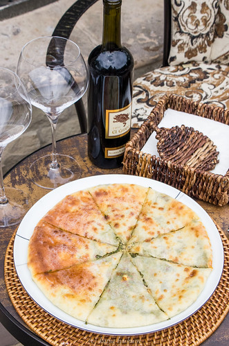

# Осетинский пирог

#### Ингредиенты

* 400г муки общего назначения
* 13г свежих дрожжей
* 100г густой сметаны
* 250мл теплой воды
* 1 яйцо (62г)
* 1 ч.л. соли
* 1 ч.л. сахара
* 2 ч.л. масла грецких орехов

#### Приготовление

Начинать с увлажнения и оживления дрожжей: 1 ч.л. дрожжей + 50мл теплой воды + 1 ч.л. сахара.  
Смешать все, кроме масла, вымешивать К-образной насадкой на средней скорости, пока тесто не соберется вокруг насадки. Добавить масло, домесить.  
Расстоять 1 час накрытым в теплом месте. Оно должно увеличиться в объеме три раза.

*Все традиционные начинки (кроме мясных и сладких) для осетинских пирогов состоят из овечьего молодого сыра + […] в пропорции 1:1. В квадратные скобки можно вписать много чего из длинного списка: тушеная капуста, черемша, зеленый лук, укроп, грибы, тыква, картофельное пюре, и так далее. Эти ингредиенты могут быть использованы с сыром дуэтом, или в комбинациях. Тогда смесь должна быть равно по весу сыру. В качестве начинки может быть только молодой овечий сыр и такой пирог называется уалибах. За пределами Осетии, где невозможно найти настоящий осетинский сыр, его проще всего заменять овечьей фетой. Тесто это очень нежное. Ему не нравятся длинные ногти и грубые крупные куски начинки. Даже крупные куски холодного сыра. Именно поэтому все должно быть меленьким, мягеньким и хорошо смешанным руками, которые своим теплом размягчают сыр.*

Ком начинки выложить в центр раздавленной ладонями до толщины 1,5 см лепешки. Затем начинку чуть раздавить.  
Тесто собрать вокруг начинки в мешочек, закрепить собранный узелок теста и раздавить его. Ладонями аккуратно раздавить все в плоскую лепешку с 3-4 переворачиваниями и подпыливаниями мукой. Последний переворот сделать уже в форму и в центре пирога проделать дырочку в верхней части теста для выхода пара.  
Выпекать в разогретой до максимальной температуры духовке на нижней полке в течение 5 минут, затем переместить на верхнюю на следующие 5 минут, а вниз поставить следующий пирог.

Подают традиционно стопками по 3 пирога.

[*https://laperla-foto.livejournal.com/90440.html*](https://lyukum.livejournal.com/291629.html)
