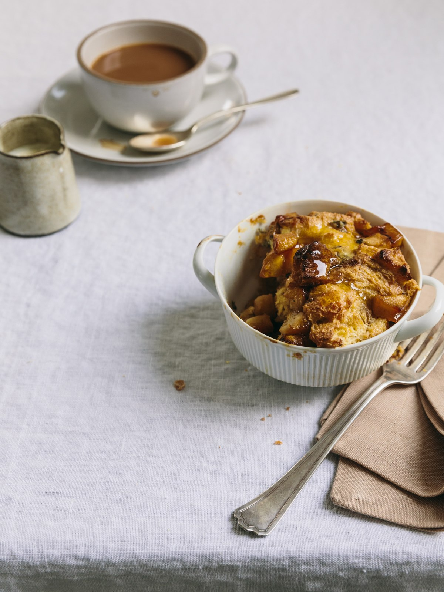

---
image: ../pics/pudding.jpg
---
# Пудинг из яблок, голубого сыра и хлеба

#### Ингредиенты

на 1 порцию

* 15 г размягченного несоленого сливочного масла
* 2 больших яйца
* 60 мл цельного молока (при необходимости больше)
* 50 г сахарного песка
* щепотка соли
* 1 раскрошенный толстый ломтик хлеба
* 1 очищенное от серединки и кожуры маленькое яблоко или груша
* 30 г растертого голубого сыра
* мед и морская соль для украшения

#### Приготовление

Разогреть духовку до . Смазать сливочным маслом пригодный для использования в духовке горшочек емкостью 250 мл.

Взбить яйца и молоко с солью и сахаром. Добавить хлеб, яблоки и сыр и размешать, убедившись в том, что хлеб как следует размок. Если смесь выглядит суховатой, подлить молока. Выложить в подготовленную, смазанную маслом форму. Выпекать в разогретой до 200°C духовке около 30 минут, пока верхушка пудинга не схватится. Вынуть и остудить 5 минут.

Подавать, полив медом и присыпав морской солью по вкусу.

*Рецепт из Kinfolk vol.11*
