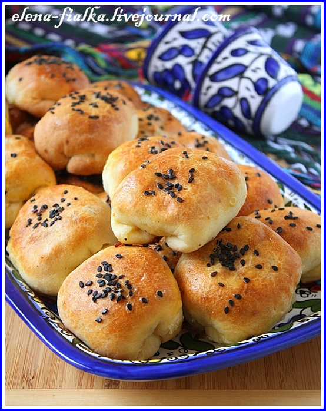

---
image: ../pics/67106784_samsadoma.jpg
---
# Самса по-домашнему

#### Ингредиенты

* 500 гр мука
* 1 яйцо
* 250 мл кефир
* 150 гр охлажденный маргарин
* 1 ч.л с горкой соль
* 0.5 ч.л разрыхлитель
* 1 яйцо для смазывания самсы
* Тмин,кунжут,семена кумина,чернушка на выбор

**для начинки:**

* Мякоть телятины или говядины 400 гр \(предварительно замороженное\)
* Курдючное сало 100 гр
* Лук репчатый 450 гр
* Вода 1\3 ст
* Черный крупно молотый перец
* Красный перец
* Зира
* Соль

#### Приготовление

Просеять муку в миску. Маргарин натереть на тёрке и добавить к муке, тщательно растирая пальцами перемешать муку с маргарином , сделать в центре углубление.

В небольшую миску добавить яйцо, соль, взбить венчиком, добавить к муке. Добавить кефир и разрыхлитель, замесить тесто. Тесто должно быть мягким и не приставать к рукам. Завернуть тесто в пленку и убрать в холодильник на 30-40 минут.

Приготовить начинку. Нарезать замороженное мясо и сало пластинками, потом тонкими полосками, потом кубиками.Очистить лук и порезать кубиками, добавить к мясу. Приправить специями, посолить, добавить воды и приготовить фарш.

Готовое тесто разделить на 2 части. Из каждой сделать 2 брусочка, поделить каждый брусочек на 10-15 частей. На присыпанной поверхности раскатать каждый в круг, стараясь раскатывать по кругу, чтобы середина круга была толще, чем края. Положить приготовленную начинку в центр, примерно 1 ст.л и слепить самсу. Самсу можно сделать треугольную, квадратную и даже круглую.

Выстелить на противень пекарскую бумагу и положить на неё самсу на некотором расстоянии друг о друга. Взбить яйцо венчиком и смазать каждую самсу. Посыпать семенами кунжута или тмином и т.д. Поставить в разогретую духовку до 180 на 25 минут. Если в процессе быстро зарумянились самса, можно прикрыть пекарской бумагой и допечь.

*elena-fialka.livejournal.com*
