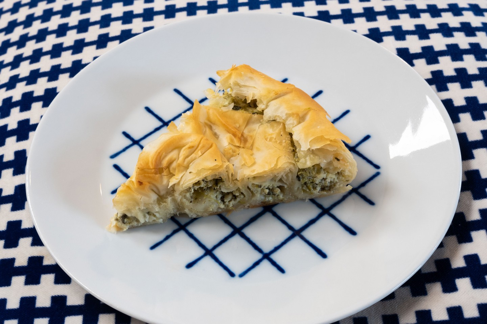

---
image: ../pics/spanakopita.jpg
---
# Спанакопита

#### Ингредиенты

* фета 300 г
* шпинат 600 г
* укроп пучок
* петрушка пучок
* мускатный орех
* растительное масло 45 мл
* яйцо 2 штуки
* тесто фило 7 листов
* сливочное масло для смазывания
* соль, перец
* кунжут для украшения

#### Приготовление

Шпинат нарезать, посолить. Укроп, петрушку мелко нарезать. Отжать шпинат, если требуется, смешать с другой зеленью, приправить перцем, мускатным орехом, добавить растительное масло. Фету раскрошить, смешать со шпинатом, добавить яйца и хорошо вымесить.

Форму смазать маслом, присыпать мукой. Выстелить форму листами теста фило, оставив излишки свисать по краям. Смазать тесто растопленным маслом, затем добавить начинку, сформировать ровный слой, накрыть краями теста, смазать маслом. Скомкать еще 2 листа фило и положить сверху, сбрызнуть маслом. Посыпать кунжутом.

Выпекать при 180 °C на 10-15 минут или до золотистого и хрустящего состояния, затем остудить 15 минут перед подачей.

*tiktok:notorious foodie*
