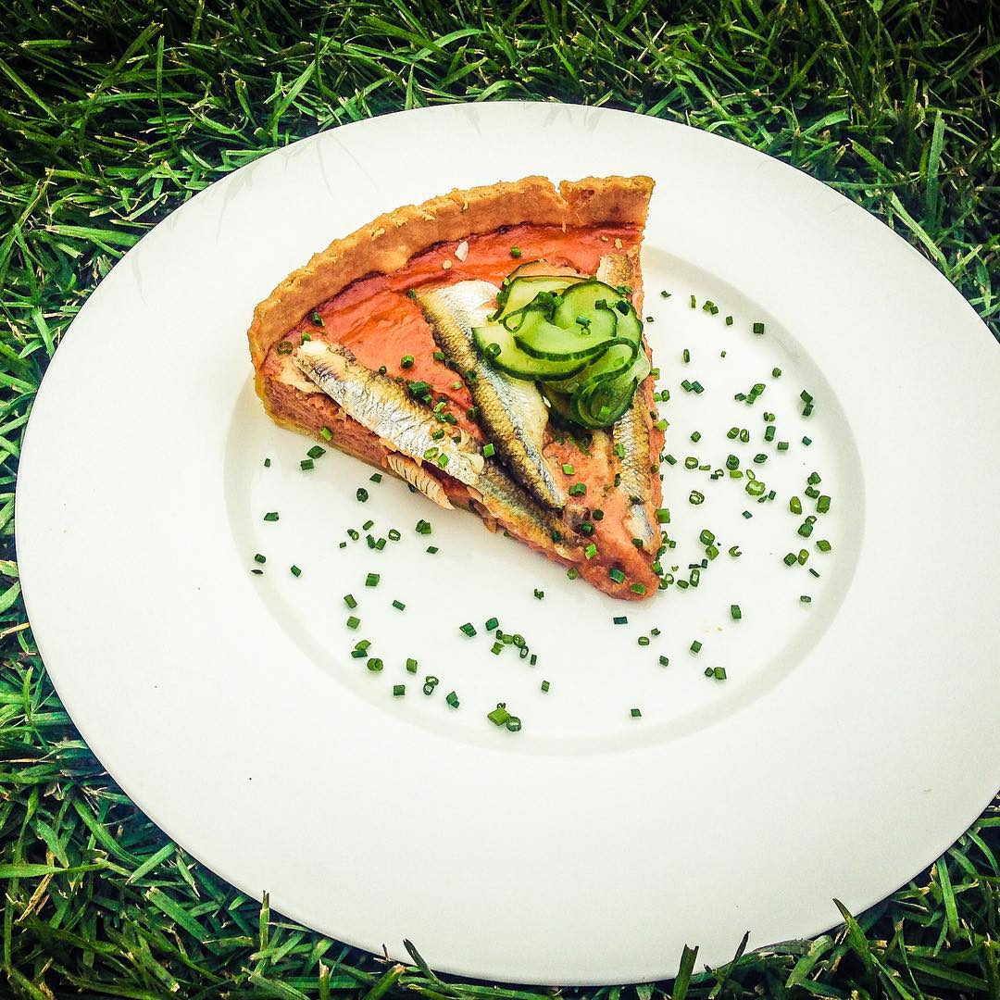

---
image: ../pics/tart-puttaneska.jpg
---
# Пирог с корюшкой и соусом «путанеска»

#### Ингредиенты

* [тесто для тарта](https://mars9n9.github.io/%D0%92%D1%8B%D0%BF%D0%B5%D1%87%D0%BA%D0%B0/%D0%9A%D0%B8%D1%88-%D0%BB%D0%BE%D1%80%D0%B5%D0%BD/ix.html)
* [соус путанеска](https://mars9n9.github.io/%D0%9F%D0%B0%D1%81%D1%82%D0%B0%20%D0%B8%20%D1%80%D0%B8%D0%B7%D0%BE%D1%82%D1%82%D0%BE/%D0%9F%D0%B0%D1%81%D1%82%D0%B0/spaghetti-puttanesca.html)
* корюшка или сардины
* пармезан
* оливки

#### Приготовление

Приготовить основу для тарта, выпечь под грузом 10-15 минут.

Приготовить соус, пробить блендером, если необходимо, можно добавить немного томатной пасты для яркости цвета.

Выложить соус в основу для тарта. Острым ножом разрезать сардины пополам вдоль, выложить на тарт, украсить нарезанными оливками, сбрызнуть оливковым маслом, приправить черным перцем и солью. Прогреть в духовке при 190С конвекция 2 минуты.

Подавать теплым, украсив зеленью и огурцом.