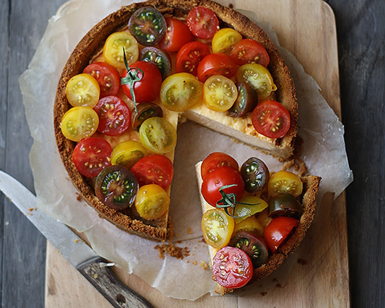
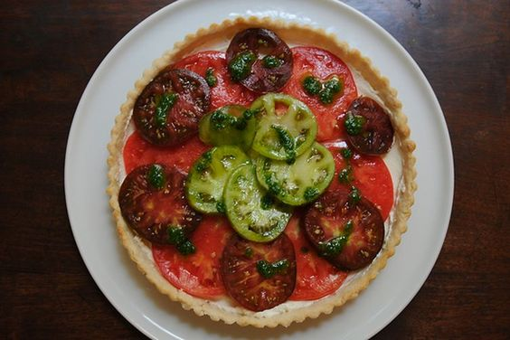

---
image: ../pics/tomato-cheesecake.jpg
---
# Томатный чизкейк

#### Ингредиенты

**для основы:**

* основа для тарта  

или

* 200 г молотых крекеров
* 100 г растопленного сливочного масла

**для начинки:**

* 3 крупных разноцветных помидора или разноцветные помидоры черри
* 300 г сливочного сыра
* 150 г сыра чеддер, натереть
* 2 яйца
* щепотка соли и молотого перца
* 150 помидоров-черри, вымыть
* 50 мл оливкового масла
* 10 мл уксуса \(1 столовая ложка\)
* 1/4 чайной ложки молотого тмина
* 1 зубчик чеснока, выдавить
* 1 чайная ложка соли
* 1 щепотка молотого черного перца

**для песто:**

* 1 чашка свежих листьев базилика
* 1/4 чашки оливкового масла
* 1 зубчик чеснока

#### Приготовление

Приготовить и выпечь основу для тарта. или Нагреть духовку до 180º C. В миске смешать крекеры с маслом. Выложить эту массу на форму и плотно утрамбовать ее на дне. Поставить форму в холодильник.

В чаше для миксера взбить сыр с яйцами, посолить, поперчить, перемешать до однородности. Перелить начинку в форму и отправить в духовку на 20-25 минут. Достать из духовки и остудить до теплого состояния.

Приготовить песто, смешав все ингредиенты в фуд процессоре.

Смешать уксус с маслом и специями. Помидоры нарезать и смешать с заправкой. Выложить помидорный салат на испеченный чизкейк. Украсить песто. Подавать сразу.

## Томатный чизкейк без выпечки

#### Ингредиенты

**для начинки:**

* 3 крупных разноцветных помидора или разноцветные помидоры черри
* 300 г сливочного сыра
* 2 чайных ложки лимонного сока

#### Приготовление

Смешать сыр маскарпоне с лимонным соком. Выложить на охлажденную основу. Помидоров нарезать, выложить поверх сыра, посыпать солью и перцем. Украсить песто. Подавать сразу.

*food52.com*
