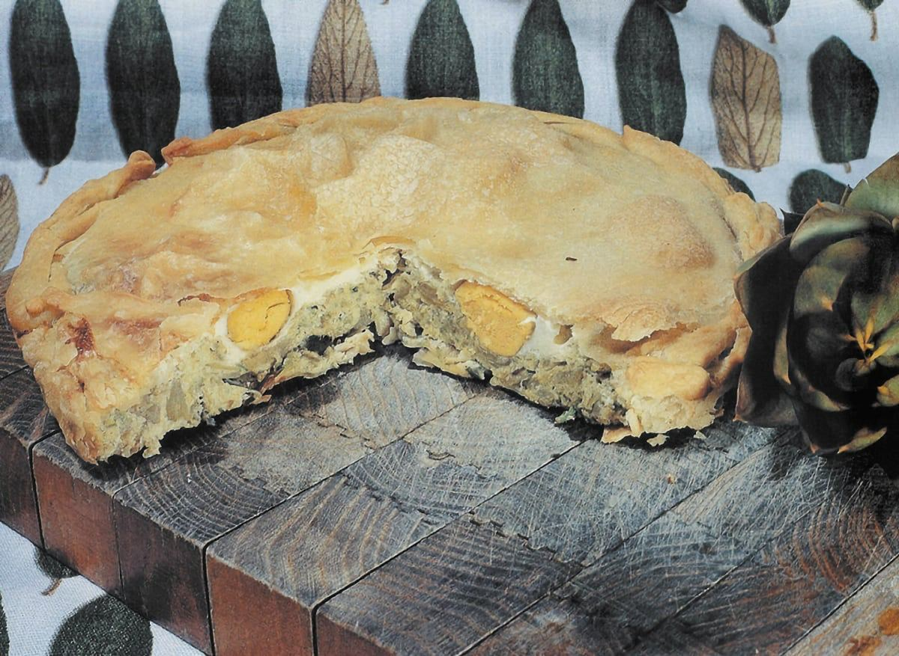

---
image: ../pics/torta-pasculiana.jpg
---
# Паскуалина \| Torta pasqualina

#### Ингредиенты
на 4 порции

* тесто фило 500 г
* 500 г шпината и мангольда
* 250 г рикотты
* чеснок 1 зубчик
* 25 листьев базилика
* 50 г сливочного масла
* мускатный орех
* 60 г пармезана
* 5 яиц
* оливковое масло первого холодного отжима
* мак
* соль

#### Приготовление

В большой кастрюле растопить сливочное масло и обжарить очищенный, хорошо промытый и высушенный шпинат и мангольд с чесноком на умеренном огне, пока не выпарится лишняя вода. Снять с огня и добавить крупно нарезанный базилик, рикотту, щепотку соли, щепотку мускатного ореха, майоран, 1 яйцо и тертый пармезан.

Смазать дно формы и выложить 13 слоев фило теста один за другим, каждый смазывая маслом, за исключением последнего.

Распределить начинку, сделать ложкой углубления, в которые нужно разбить яйца, слегка посолить.

Выложить 20 слоев теста поверх начинки. Смазать маслом и взбитым яйцом и посыпать маком.  
Готовить при температуре 180°C 50 минут до золотистого цвета.

*eda.ru*
