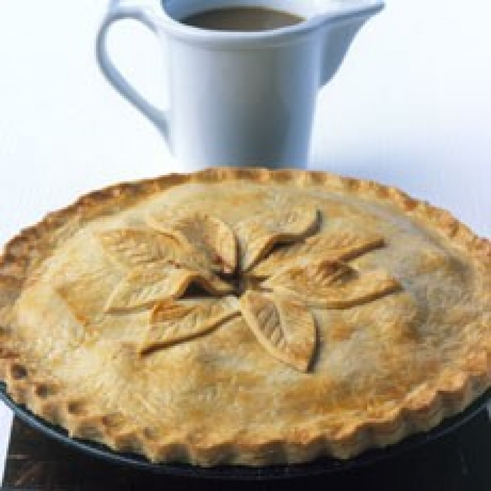

# Традиционный английский пирог с кроликом

#### Ингредиенты:

[тесто с чеддером](https://mars9n9.github.io/cakes/)

 **для начинки:**

* 1 кролик, приблизительно 1,35 кг, разрезанный на суставы
* 40 г обычной муки
* 40 г сливочного масла
* соль и свежемолотый черный перец
* 2 средних лука, нарезанных довольно маленьким
* 225 г сырого копченого бекона
* 1 яблоко, очищенное и нарезанное ломтиками
* 110 г чернослив без косточек
* 275 мл сухого сидра
* 425 мл бульона или воды
* ½ цельного мускатного ореха, тертого
* 1 лавровый лист

#### Приготовление:

Кролика вымыть и поместить в кастрюлю, добавить лук, яблоко и лавровый лист, нарезать бекон кубиками и добавить в кастрюлю к мясу. Влить сидр и бульон, довести до кипения, снять пену и варить на медленном огне под крышкой около часа или до готовности.

Готового кролика вынуть вместе с другими твердыми ингредиентами, бульон оставить. Смешать муку и масло до гладкой пасты и добавить к бульону, на среднем огне сварить соус помешивая и разбивая комочки. Добавить мускатный орех.

Приготовить тесто и выложить в форму нижний слой.

Выложить мясо кролика без костей и другие ингредиенты в форму, полить горячим соусом.

Верхний слой теста раскатать шире чем ширина формы. Выложить тесто и запечатать края, сделать в центре отверстие для выхода воздуха. Запекать 30 минут при 220°C или до золотистого цвета.

*deliaonline.com*
