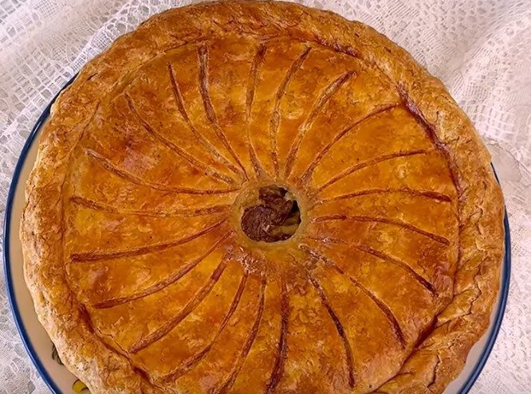

---
image: ../pics/venetian-pie.jpg
---
# Венецианский пирог с грибами

#### Ингредиенты
на форму 20-22 см

**для начинки:**
* смесь грибов (шампиньоны и лисички) 500 г
* сливочное масло 50 г
* молодой козий сыр 100 г
* пармезан 50 г
* грюйер 50 г
* 1 яйцо
* сметана 30 г
* мидии 100 г

**для песочного теста:**
* мука 400 г
* сливочное масло 200 г
* вода 70-100 г воды
* соль 7 г
* щепотка шафрана
* смесь черного перца, длинного перца "Пиппали", мускатного ореха и гвоздики 10 г

#### Приготовление

Приготовить [песочное тесто](https://mars9n9.github.io/%D0%92%D1%8B%D0%BF%D0%B5%D1%87%D0%BA%D0%B0/%D0%9A%D0%B8%D1%88-%D0%BB%D0%BE%D1%80%D0%B5%D0%BD/ix.html), завернуть в пищевую пленку и убрать в холодильник на ночь.

Разделить выдержанное тесто на две неравные части, большую часть размять и раскатать до толщины 3-4 мм, накрутить на скалку и выложить в форму, смазанную сливочным маслом. Срезать излишки, наколоть дно вилкой, убрать в холодильник.

Грибы нарезать, выложить на холодную сковороду, добавить воду и немного сливочного масла, обжарить на сильном огне пока вода не выпарится, а затем добавить больше сливочного масла и обжарить до коричневой корочки.

Грибы выложить в миску, смешать с раскрошенным молодым сыром, добавить яйцо и сметану, пармезан и грюйер, посолить и поперчить. Остудить.

Вынуть основу из холодильника, выложить начинку. Раскатать вторую часть теста, перенести на скалке на основу, срезать лишнее и хорошо защипить края 2 раза, свернуть в жгутик. Проделать отверстие в центре. Нанести ножом насечки на верхушке, но не прорезать насквозь. Охладить в холодильнике 1 час. После охлаждения, смазать смесью яйца и молока. Выпекать при 180 (конвекция) 1 час, накрыть фольгой, если будет подгорать. Остудить, подавать теплым.

*youtube: Nina Tarasova*