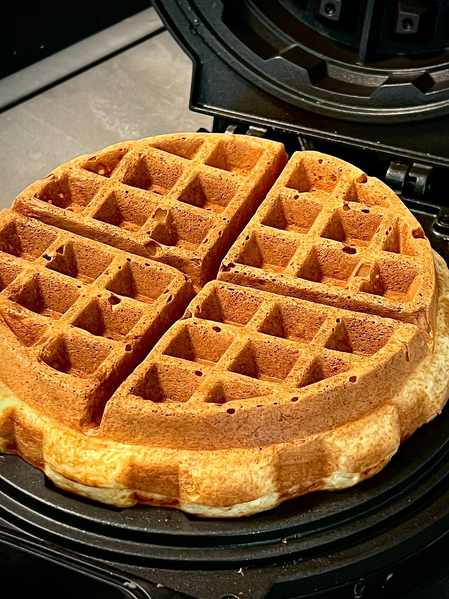

---
image: ../cakes/pics/waffles.jpg
---
# Толстые вафли

#### Ингредиенты

* кефир 180 г
* 1 желток
* сахар 15 г
* соль 1,5 г
* растительное масло 20 г

* слабая мука 85 г
* сода 2 г
* разрыхлитель 1 г

* 1 белок

#### Приготовление

Смешать все влажные ингредиенты, отдельно смешать сухие. Взбить белок до устойчивой пены. Вмешать сухие ингредиенты во влажные, не вымешивать, быстро вмешать белок. Выпекать сразу.

Вариации:
1. посыпать тертым пекорино перед закрытием вафельницы. сделать сендвич из вафли с сыром чеддар и яичницей
2. добавить в тесто сублимированную клубнику и кусочки шоколада

*Иван Шишкин*