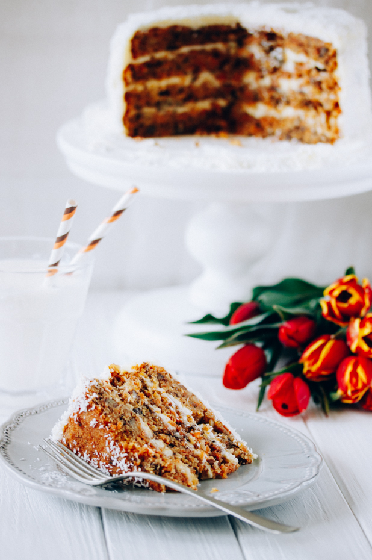

# Морковный торт с маскарпоне и кокосом \| Carrot cake with mascarpone & coconut

**Ингредиенты:**

на 2 формы 16 см

**для коржей:**

* 178 гр сливочного масла
* 4 яйца
* 160 гр белого сахара
* 160 гр коричневого сахара
* 8 гр ванильного сахара
* 225 гр муки
* 1 ч. л. разрыхлителя
* 1 ч. л. с горкой корицы
* 3 ст. моркови
* 1 ст. грецких орехов
* 195 мл растительного масла

**для крема:**

* 142 гр сливочного масла, комн. температуры
* 355 гр маскарпоне \(или сливочного сыра\)
* 1,7 ст. сахарной пудры

**для декора:**

* 133 гр кокосовой стружки 

#### Приготовление:

Разогрейте духовку до 175 градусов. Подготовьте две разъемные формы 18 см.

Морковь натереть, нарубить грецкие орехи. Растопить масло и дать ему остыть.

Взбить яйца с сахарами в белую пену, влить сливочное и растительное масла и ванильный сахар и снова взбить.

В миске соединить просеянную муку, разрыхлитель, корицу. Добавить все в тесто и перемешать. Вмешать морковь и орехи.

Разделить тесто на две части, вылить в формы и выпекать 45-50 минут или до сухой спички.

Соединить масло и маскарпоне и взбить до получения однородного крема, добавить сахарную пудру и снова взбить, охладить в холодильнике до загустения.

Каждый корж разрезать вдоль пополам, чтобы получить 4 коржа. Собрать торт, промазывая коржи кремом и укладывая друг на друга. Смазать верх и бока торта, присыпать все кокосовой стружкой.

[_http://www.eatmeblog.com/2015/04/carrot-cake-with-mascarpone-coconut.html_](http://www.eatmeblog.com/2015/04/carrot-cake-with-mascarpone-coconut.html)

