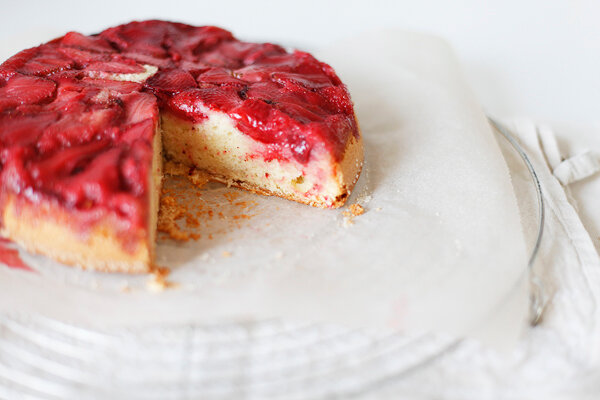

# Перевернутый сливочный кекс с клубникой

**Ингредиенты:**

на форму 23-25 см

* 3 яйца
* 180г сахара
* 150г муки
* 30г молотого миндаля
* 150г сливок для взбивания 33%
* 400г клубники
* 1 ч.л. крахмала

#### Приготовление:

Подготовить форму - смазать маслом и присыпать сахаром.

Клубнику вымыть, обсушить, срезать хвостики и нарезать ее пластинками толщиной 3мм. Выложить их в форму в 3 слоя так, чтобы на дне лежали самые красивые кусочки, присыпать крахмалом через сито.

Яйца взбить с сахаром в пышную белую пену. Просеять муку и всыпать в тесто муку и миндаль, перемешать. Добавить взбитые сливки, перемешать. Вылить тесто в форму на ягоды

Выпекать 45 минут при 180С. Готовый пирог оставить в духовке на 5-10 минут, потом достать, перевернуть на решетку или тарелку.

[_https://chadeyka.livejournal.com/269979.html_](https://chadeyka.livejournal.com/269979.html)

