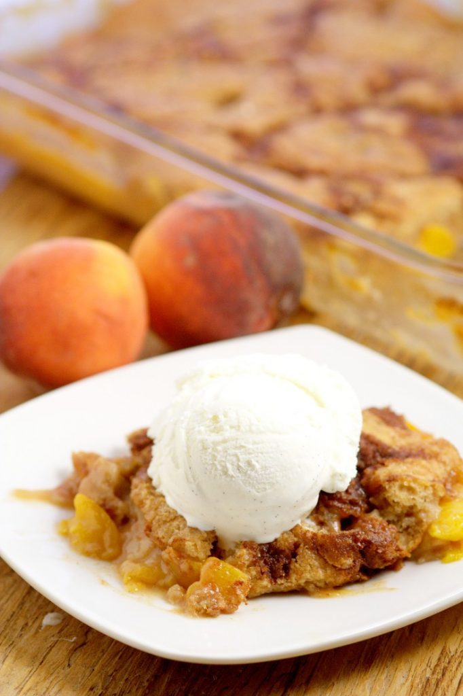

# Персиковый кобблер

#### Ингредиенты:

**для персиков:**

* 8-12 средние спелые персики
* 113 г сливочное масло
* 1/4 стакана сахар
* 1/4 стакана коричневого сахара
* 1/8 чайной ложки мускатного ореха
* 1/2 чайной ложки корицы
* 1 чайная ложка лимонного сока
* 2 чайные ложки муки

**для теста:**

* 1/2 стакана коричневого сахара
* 1/2 стакана сахара
* 1 стакан муки
* 2 чайных ложки разрыхлителя
* 1 стакан молока
* 1 чайная ложка ванили

#### Приготовление:

Приготовить персики. Нарезать персики, смешать все ингредиенты кроме масла в миске, добавить персики и перемешать. Вылить растопленное масло в форму для запекания. Распеределить сверху персики. Запекать 10 минут при 220 C

Приготовить тесто. Хорошо смешать все ингредиенты в миске. В отдельной миске смешать 3 столовые ложки сахарного песка с 1 чайной ложкой корицы. Это будет хрустящий топпинг.

Готовые персики вылнуть из духовки, вылить на них жидкое тесто, затем добавить смесь корицы и сахара. Выпекать 25-30 минут в духовке при 190 С, до сухой спички

Подавать теплым с мороженым.

[_https://www.thegraciouswife.com/southern-peach-cobbler/_](https://www.thegraciouswife.com/southern-peach-cobbler/)\_\_

