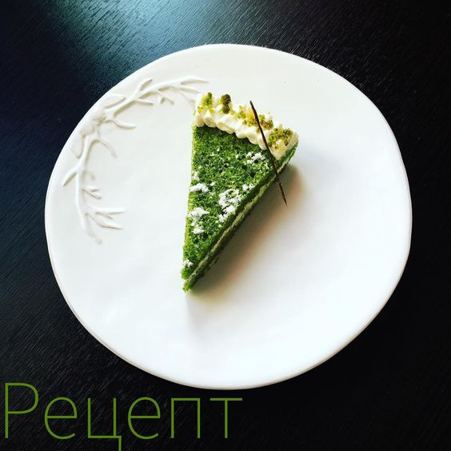

# Пирог шпинат-ваниль-лимон

**Ингредиенты:**

форма 16 см **тесто:**

* 110гр свежего шпината
* 1 яйцо
* 80гр сахара
* 80гр растительного масла без запаха
* 95гр муки
* 1ст.л. лимонного сока
* 1ч.л. разрыхлителя
* цедра 1 лимона

**крем:**

* 100гр сливок от 30%
* 100гр маскарпоне
* 2ст.л. сахарной пудры
* Ванильный экстракт

#### Приготовление:

Шпинат, растительное масло, лимонный сок и цедру смешать блендером до однородности.

Яйцо взбить с сахаром до пышности. Добавить шпинатную смесь, еще раз взбить на маленькой скорости.

Муку смешать с разрыхлителем, просеять, всыпать в тесто и аккуратно быстро вмешать лопаткой.

Перелить в смазанную маслом форму \(дно застелить пергаментом\).

Выпекать 30-35 минут при 170С. Еще горячим вытащить из формы, остудить на решетке.

Для крема взбить сливки с маскарпоне, сахарной пудрой и ванильным экстрактом.

Корж разрезать вдоль на 2 части. Перемазать кремом. Дать постоять в холодильнике пару часов.

[_https://www.instagram.com/p/BdAarEilTCj/_](https://www.instagram.com/p/BdAarEilTCj/)

