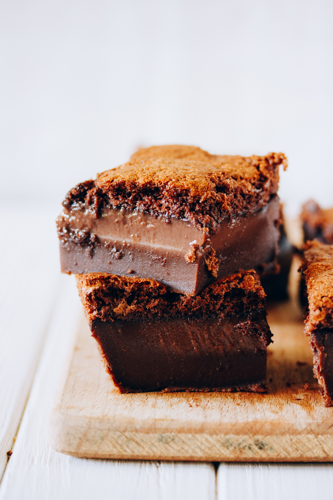

# Пирог со вкусом кофе и шоколада \| Magic custard cake with mocha flavor

**Ингредиенты:**

на форму 20 х 20 см

* 115 гр сливочного масла
* 4 яйца
* 120 гр муки
* 220 гр сахарной пудры
* 2 ст. л. \(с горкой\) темного какао порошка 
* 1/2 порции эспрессо \(25-30 мл\)
* 600 гр теплого молока

  \*\*\*\*

**Приготовление:**

Разделить яйца на белок и желток, взбить желтки с сахаром. Масло растопить, растопленное масло и эспрессо ввести в яичную массу и взбить еще раз.

В отдельной миске просеять муку и какао, смешать и ввести их в тесто. Аккуратно ввести молоко.

Взбить белки до жестких пиков и аккуратно, в несколько этапов ввести в тесто.

Вылить тесто в форму, выстеленную пергаментом, и выпекать около часа при 160°С, пирог должен чуть пошатываться при ударе о форму, но не быть жидким.

Подавать полностью остывшим

[_http://www.eatmeblog.com/2015/08/mocha-magic-custard-cake.html_](http://www.eatmeblog.com/2015/08/mocha-magic-custard-cake.html)

