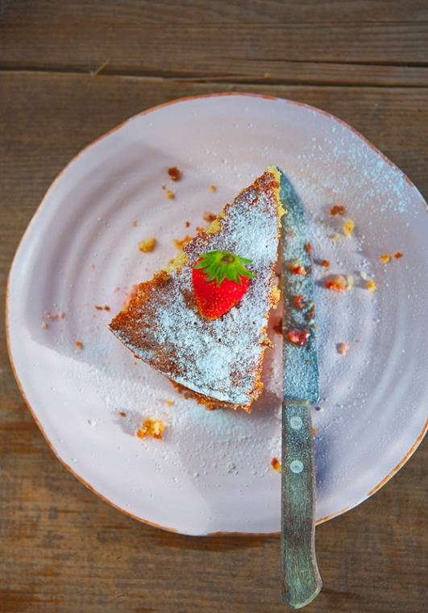

# Простой клубничный пирог \| Torta di fragole semplice

#### Ингредиенты:

на форму диаметром 26 см

* 5 ст. л. молока, жирность 4%
* 180 г мелкокристаллического сахара
* 200 г сливочного масла комнатной температуры
* 4 куриных яйца
* свеженатертая цедра 1 среднего лимона
* 250 г пшеничной муки 00
* 8 г разрыхлителя
* 400 г свежей клубники

#### Приготовление:

Разогрейть духовку до 190°С. 

Клубнику помыть и разрезать пополам. 

В большую миску сложить сливочное масло, сахар и взбить в однородную массу миксером, работающим на высокой скорости. Продолжая взбивать, добавить яйца, по одному. Затем влить молоко тонкой струйкой, всыпать муку, просеянную с разрыхлителем и добавить цедру, хорошо перемешать.

В форму вылить половину теста, выложить клубнику и залитьвторой половиной теста. Выпекать 40-50 минут.

Подавать посыпав сахарной пудрой и украсив свежими ягодами.

\_\_[_http://elladkin.livejournal.com/475210.html_](http://elladkin.livejournal.com/475210.html)\_\_

